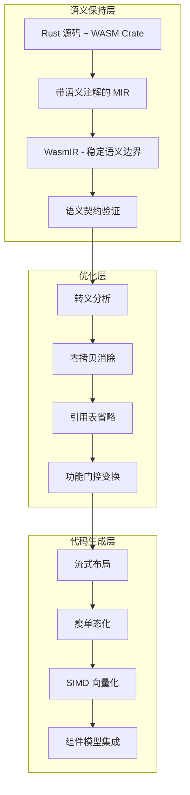
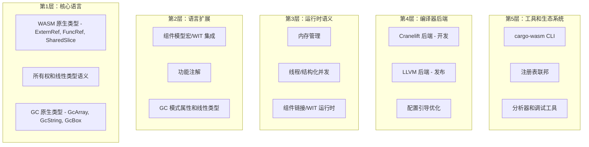

# Wasm-Native Rust 优化项目需求文档

## 项目概述

WasmRust 是一个专为 WebAssembly 设计的 Rust 专业化系统，旨在直接与 MoonBit 在启动延迟、二进制大小和开发者体验方面竞争，同时保持 Rust 的生态系统优势。该系统通过语义保持编译（WasmIR）、流式实例化、零拷贝抽象和 WasmGC 准备性来实现 MoonBit 级别的性能。

**核心理念**: WasmRust 窃取 MoonBit 的语义时机，匹配其启动和大小性能，同时在生态系统和控制力方面超越它。这不是"更好的 Rust → WASM"，而是"作为 Wasm 原生系统语言的 Rust"。

## WasmIR: 一流语义边界

WasmIR 作为稳定的语义契约，保持传统 LLVM 降低中丢失的 WASM 特定不变量：

**编码的语义**：
- 带生命周期跟踪的 ExternRef 和 FuncRef
- 线性 vs 共享 vs 托管内存区域
- 组件模型 ABI 契约
- 功能注解（线程、JS、GC、SIMD）
- 所有权和线性不变量
- 零拷贝优化机会

**为什么重要**: LLVM 和 wasm-opt 无法推断已经擦除的语义。MoonBit 获胜是因为它不擦除它们。WasmIR 保留这些语义用于激进优化。

### 编译器-Crate 语义契约

WasmRust 通过编译器和 wasm crate 之间的正式契约实现 MoonBit 级别的优化：

```rust
// 正式语义契约启用激进优化
/// # Safety Contract
/// 编译器可以假设：
/// - handle 是不可伪造的 externref
/// - 不允许指针算术
/// - drop 对主机是可观察的
/// - 转义分析：永不错名线性内存
#[repr(transparent)]
pub struct ExternRef<T> {
    handle: u32, // 映射到 WASM externref
    _marker: PhantomData<T>,
}

/// # Safety Contract  
/// 编译器可以假设：
/// - T: Pod 意味着无指针，无 drop glue
/// - 由线性内存支持，读取竞争安全
/// - 写入由 Rust 别名规则管理
/// - 可证明安全时可以消除边界检查
pub struct SharedSlice<'a, T: Pod> {
    ptr: NonNull<T>,
    len: usize,
    _marker: PhantomData<&'a [T]>,
}

/// # Safety Contract
/// 编译器可以假设：
/// - 平凡可复制，无无效位模式
/// - 对零拷贝序列化安全
/// - memcpy 可以消除以直接访问
pub unsafe trait Pod: Copy + Send + Sync + 'static {}
```

**编译器识别模式**：
- `wasmrust::recognition` 用于白名单优化的 MIR 模式
- `wasmrust::semantic_contract` 用于验证的 lint 组
- 机械验证所有优化引用文档化契约

## 核心需求场景

### 需求场景 1: Wasm 原生性能对等

#### 处理逻辑
WasmRust 通过语义保持架构实现 MoonBit 级别的性能，该架构在编译过程中保持高级不变量：



#### 架构技术方案
- **WasmIR 语义边界**: 保持 WASM 特定不变量的稳定语义契约
- **编译器-Crate 契约**: 编译器和 wasm crate 之间的正式协议
- **双后端策略**: 开发使用 Cranelift，发布使用 LLVM
- **语义保持变换**: 转义分析、零拷贝消除、引用表省略

#### 影响文件
- `src/backend/cranelift/` - Cranelift 后端实现（快速开发编译）
- `src/backend/llvm/` - LLVM 后端增强（发布优化）
- `src/wasmir/` - WasmIR 中间表示（语义边界）
- `crates/wasm/src/lib.rs` - 核心 WASM 抽象（零成本类型）
- `src/compiler/recognition.rs` - MIR 模式识别
- `src/compiler/semantic_contract.rs` - 语义契约验证

#### 实现细节
```rust
// WasmIR 语义边界保持 WASM 特定不变量
pub struct WasmIRModule {
    functions: Vec<WasmIRFunction>,
    types: Vec<WasmIRType>,
    externrefs: Vec<ExternRefTable>,    // ExternRef 生命周期跟踪
    memory_regions: Vec<MemoryRegion>, // 线性 vs 共享 vs 托管内存
    capabilities: CapabilitySet,       // 线程、JS、GC、SIMD 注解
    ownership_invariants: Vec<OwnershipInvariant>, // 所有权不变量
}

// 流式编译配置实现启动优化
#[wasm::profile(streaming)]
pub struct StreamingProfile {
    thin_monomorphization: bool,   // 瘦单态化减少代码重复
    ordered_emission: bool,          // 有序函数发射
    early_exports: bool,            // 早期导出存根
    cold_code_deferral: bool,        // 冷代码延迟
    section_layout_optimization: bool, // 节布局优化
}
```

#### 边界条件与异常处理
- **语义契约违反**: 结构化错误消息，精确定位和可操作建议
- **功能检测失败**: 运行时优雅降级（线程 → 单线程，SIMD → 标量）
- **内存区域意图**: 不支持意图时加载时优雅失败，清晰错误消息
- **组件隔离绕过**: 通过模糊测试跨组件调用进行检测

#### 数据流动路径
1. **语义保持降低**: Rust 源码 → HIR/MIR → WasmIR（保持语义不变量）
2. **优化应用**: 转义分析、零拷贝消除、引用表省略、功能门控变换
3. **代码生成**: 流式布局、瘦单态化、SIMD 向量化、组件模型集成
4. **验证**: 机械验证所有优化引用文档化安全契约
5. **运行时**: 功能检测、优雅降级、零拷贝数据传输

#### 预期成果
- **二进制大小**: Hello World <2KB（匹配 MoonBit ~2KB 基线）
- **启动延迟**: 简单程序 <1ms 实例化（匹配 MoonBit ~1ms）
- **代码重复减少**: 相比标准 rustc 减少 40%+（瘦单态化）
- **语义不变量**: 所有权、线性、能力注解在降低过程中保持

### 零拷贝内存区域

WasmRust 提供消除编组开销的类型化内存区域：

```rust
// 零拷贝操作的类型化内存区域
pub struct Local<T> {
    // 栈本地，非转义
    // 编译器：可以消除边界检查，内联访问
}

pub struct SharedSlice<T: Pod> {
    // 共享内存，Pod 类型的竞争安全
    // 编译器：可以在功能不存在时重新排序加载，省略原子操作
}

pub struct ExternRegion<T> {
    // 主机管理的内存区域
    // 编译器：转义分析，不与线性内存错名
}

// 零拷贝是默认快速路径
impl<T: Pod> SharedSlice<T> {
    // 直接内存访问，无 memcpy
    pub fn get(&self, index: usize) -> Option<&T> {
        // 编译器在可证明安全时消除边界检查
        unsafe { self.ptr.add(index).as_ref() }
    }
}
```

### 需求场景 2: 零拷贝内存抽象

#### 处理逻辑
WasmRust 通过类型化内存区域和语义契约实现零拷贝作为默认快速路径，消除 MoonBit 通过原生 VM 集成消除的编组开销：

```rust
// 零拷贝内存区域类型
pub struct Local<T> {
    // 栈本地，非转义
    // 编译器：可以消除边界检查，内联访问
}

pub struct SharedSlice<T: Pod> {
    // 共享内存，Pod 类型竞争安全
    // 编译器：可以重排序加载，在功能不存在时省略原子操作
}

pub struct ExternRegion<T> {
    // 主机管理的内存区域
    // 编译器：转义分析，不与线性内存错名
}

// 零拷贝是默认快速路径
impl<T: Pod> SharedSlice<T> {
    // 直接内存访问，无 memcpy
    pub fn get(&self, index: usize) -> Option<&T> {
        // 编译器在可证明安全时消除边界检查
        unsafe { self.ptr.add(index).as_ref() }
    }
}
```

#### 架构技术方案
- **类型化内存区域**: Local<T>（栈本地）、SharedSlice<T: Pod>（共享）、ExternRegion<T>（主机管理）
- **Pod 类型约束**: 平凡可复制、无无效位模式、对零拷贝序列化安全
- **编译器优化**: memcpy 消除、加载重排序、功能不存在时原子省略
- **语义契约**: 编译器可以假设的具体不变量和优化权限

#### 影响文件
- `crates/wasm/src/memory.rs` - 内存区域抽象实现
- `crates/wasm/src/pod.rs` - Pod trait 和安全约束
- `crates/wasm/src/externref.rs` - 外部引用和主机内存
- `src/compiler/zero_copy.rs` - 零拷贝优化管道
- `crates/wasm/SAFETY.md` - Pod 和 SharedSlice 契约文档

#### 实现细节
```rust
// Pod trait 安全保证 - 编译器契约的关键部分
/// # Safety Contract
/// 编译器可以假设：
/// - 平凡可复制，无无效位模式
/// - 对零拷贝序列化安全
/// - memcpy 可以消除以直接访问
pub unsafe trait Pod: Copy + Send + Sync + 'static {
    // 编译器可以使用此 trait 进行优化决策
}

/// # Safety Contract  
/// 编译器可以假设：
/// - T: Pod 意味着无指针，无 drop glue，按位可移动
/// - 由线性内存支持，并发读取竞争安全
/// - 写入由 Rust 错名规则管理
/// - 在可证明安全时可以消除边界检查
pub struct SharedSlice<'a, T: Pod> {
    ptr: NonNull<T>,
    len: usize,
    _marker: PhantomData<&'a [T]>,
}

impl<T: Pod> SharedSlice<T> {
    #[inline(always)]
    pub fn get(&self, index: usize) -> Option<&T> {
        // 编译器优化：当可证明安全时消除边界检查
        unsafe { 
            if index < self.len {
                Some(&*self.ptr.add(index))
            } else {
                None
            }
        }
    }
}
```

#### 边界条件与异常处理
- **边界检查消除**: 仅在编译器可证明安全时消除，保留运行时检查
- **Pod 类型违规**: 编译时错误，要求显式 Pod trait 实现
- **并发访问**: 通过 Rust 错名规则和 Pod 约束预防数据竞争
- **内存区域错名**: ExternRegion 通过契约保证不与线性内存错名

#### 数据流动路径
1. **类型验证**: 编译时验证 Pod 约束和内存区域类型
2. **访问模式分析**: 编译器分析内存访问模式和安全证明
3. **优化应用**: memcpy 消除、加载重排序、原子省略
4. **直接内存访问**: 生成直接内存访问指令，无运行时开销
5. **运行时验证**: 仅在需要时保留边界检查和安全验证

#### 预期成果
- **零拷贝默认**: 100% Pod 操作零拷贝，消除不必要编组
- **直接内存访问**: 编译器生成直接内存访问，无 memcpy 开销
- **并发安全**: 通过类型系统约束预防数据竞争
- **性能保证**: JS 互操作 Pod 数据零拷贝传输

### 需求场景 3: JavaScript 互操作性

#### 处理逻辑
WasmRust 通过类型安全的 ExternRef 抽象和主机配置文件支持实现可预测性能的 JavaScript 集成，支持双向函数调用和显式所有权语义：

```rust
// JavaScript 互操作抽象 - 编译器契约关键部分
/// # Safety Contract
/// 编译器可以假设：
/// - 1:1 映射到 WASM externref
/// - 不透明句柄，不可解引用指针
/// - 不与 Rust 内存错名
/// - 没有 Rust 可见的内部可变性
/// 
/// 禁止假设：
/// - 超出 Rust 类型的任何生命周期或所有权
/// - GC 行为或主机身份稳定性
/// - 相等句柄表示相等对象
#[repr(transparent)]
pub struct ExternRef<T> {
    handle: u32, // 索引到运行时引用表
    _marker: PhantomData<T>,
}

impl<T> ExternRef<T> {
    // 编译器可以优化为直接 WASM externref 调用
    pub fn call<Args, Ret>(&self, method: &str, args: Args) -> Result<Ret, InteropError>
    where T: js::HasMethod<Args, Ret> {
        unsafe { js::invoke_checked(self.handle, method, args) }
    }
}
```

#### 架构技术方案
- **ExternRef 类型安全**: 编译时接口验证，运行时错误处理
- **主机配置文件支持**: Browser、Node.js、Wasmtime、Embedded 配置文件
- **可预测边界成本**: 每个配置文件的性能保证（<100ns、<50ns、<25ns）
- **托管引用表**: 自动引用表管理和清理
- **零拷贝传输**: Pod 类型直接内存访问

#### 影响文件
- `crates/wasm/src/js.rs` - JavaScript 互操作实现
- `crates/wasm/src/host.rs` - 主机配置文件检测和适配
- `src/runtime/js_interop.rs` - 运行时 JS 集成和引用表
- `crates/wasm/SAFETY.md` - ExternRef 语义契约文档
- `src/compiler/js_optimization.rs` - JS 调用优化

#### 实现细节
```rust
// 主机配置文件特定优化和性能保证
pub enum HostProfile {
    Browser { 
        threading: bool,           // SharedArrayBuffer + COOP/COEP
        gc: bool,                 // 现代浏览器原生支持
        js_interop_cost: Duration, // <100ns 边界成本
    },
    NodeJs { 
        worker_threads: bool,       // Worker 线程支持
        gc: bool,                 // 通过 V8 引擎支持
        js_interop_cost: Duration, // <50ns 边界成本
    },
    Wasmtime { 
        wasi_threads: bool,       // wasi-threads 支持
        gc: bool,                 // 原生支持
        host_call_cost: Duration,  // <25ns 边界成本
    },
    Embedded { 
        capabilities: MinimalCaps, // 最小功能集
        no_js_interop: bool,     // 不支持 JS 互操作
        runtime_overhead: Duration, // 最小运行时开销
    },
}

// 可预测边界成本估计 - 编译时优化决策
impl HostProfile {
    pub fn js_interop_cost_estimate(&self) -> Duration {
        match self {
            HostProfile::Browser { js_interop_cost, .. } => *js_interop_cost,
            HostProfile::NodeJs { js_interop_cost, .. } => *js_interop_cost,
            HostProfile::Wasmtime { host_call_cost, .. } => *host_call_cost,
            HostProfile::Embedded { no_js_interop: true, .. } => {
                panic!("JS interop not supported in embedded profile")
            }
        }
    }
}
```

#### 边界条件与异常处理
- **功能检测**: 运行时主机功能检测，优雅降级到支持的配置文件
- **接口验证**: 编译时接口验证，运行时类型错误处理
- **引用表管理**: 自动引用表分配、清理和生命周期管理
- **配置文件不匹配**: 不支持配置文件时的清晰错误消息和降级路径

#### 数据流动路径
1. **编译时验证**: 接口类型验证，配置文件兼容性检查
2. **运行时检测**: 主机功能检测，配置文件选择和适配
3. **导入生成**: 直接 WASM 导入声明生成，无包装器开销
4. **引用表管理**: 托管引用表分配、跟踪和自动清理
5. **零拷贝传输**: Pod 类型直接内存访问，无序列化开销
6. **错误处理**: 配置文件特定错误处理，可操作错误消息

#### 预期成果
- **可预测性能**: Browser <100ns、Node.js <50ns、Wasmtime <25ns 边界成本
- **零拷贝传输**: Pod 类型 JS-WASM 零拷贝数据传输
- **类型安全**: 编译时接口验证，运行时错误处理
- **配置文件适配**: 自动功能检测和优雅降级
- **双向调用**: 支持双向函数调用和显式所有权语义

### 需求场景 4: 编译器-Crate 语义契约

#### 处理逻辑
WasmRust 通过正式的编译器-Crate 契约实现 MoonBit 级别的优化，同时保持库优先发展。契约定义了编译器可以假设的确切不变量和优化权限：

```rust
// 正式语义契约启用激进优化
/// # Safety Contract
/// 编译器可以假设：
/// - handle 是不可伪造的 externref
/// - 不允许指针算术
/// - drop 对主机是可观察的
/// - 转义分析：永不错名线性内存
#[repr(transparent)]
pub struct ExternRef<T> {
    handle: u32, // 映射到 WASM externref
    _marker: PhantomData<T>,
}

/// # Safety Contract  
/// 编译器可以假设：
/// - T: Pod 意味着无指针，无 drop glue
/// - 由线性内存支持，读取竞争安全
/// - 写入由 Rust 错名规则管理
/// - 在可证明安全时可以消除边界检查
pub struct SharedSlice<'a, T: Pod> {
    ptr: NonNull<T>,
    len: usize,
    _marker: PhantomData<&'a [T]>,
}

/// # Safety Contract
/// 编译器可以假设：
/// - 平凡可复制，无无效位模式
/// - 对零拷贝序列化安全
/// - memcpy 可以消除以直接访问
pub unsafe trait Pod: Copy + Send + Sync + 'static {}
```

#### 架构技术方案
- **正式契约文档**: compiler-contract.md 和 SAFETY.md 中的精确不变量定义
- **白名单 MIR 模式**: wasmrust::recognition 仅允许识别和优化特定 MIR 模式
- **机械验证系统**: 所有优化必须引用文档化契约的验证系统
- **逃逸规则**: 编译器假设的所有内容必须可由纯库实现重现

#### 影响文件
- `docs/compiler-contract.md` - 编译器-Crate 契约正式规范
- `crates/wasm/SAFETY.md` - 所有公共类型的安全不变量文档
- `src/compiler/recognition.rs` - MIR 模式识别（仅白名单模式）
- `src/compiler/lints.rs` - wasmrust::semantic_contract lint 组
- `src/compiler/verification.rs` - 机械验证系统

#### 实现细节
```rust
// MIR 模式识别 - 仅允许白名单模式
pub fn recognize_whitelisted_patterns(mir: &MirBody) -> Vec<RecognizedPattern> {
    let mut patterns = Vec::new();
    
    // 仅识别和优化特定白名单模式
    for bb in mir.basic_blocks() {
        for stmt in bb.statements {
            match stmt {
                // 1. ExternRef 传递模式：_1 = ExternRef::new(_2); _3 = call foo(_1)
                Statement::Assign(box (place, Rvalue::Use(Operand::Move(source)))) 
                    if is_externref_new(&mir[source], &mir[place]) => {
                    patterns.push(RecognizedPattern::ExternRefPassThrough {
                        source: source.clone(),
                        target: place.clone(),
                    });
                }
                
                // 2. SharedSlice 加载模式：_elt = (*(_slice.ptr + idx)) where T: Pod
                Statement::Assign(box (place, Rvalue::Ref(_, place))) 
                    if is_shared_slice_load(&mir[place]) => {
                    patterns.push(RecognizedPattern::SharedSliceLoad {
                        slice_place: extract_slice(&mir[place]),
                        index: extract_index(&mir[place]),
                    });
                }
                
                // 3. Pod 复制模式：_2 = _1 where _1: T, T: Pod
                Statement::Assign(box (place, Rvalue::Use(Operand::Copy(source)))) 
                    if is_pod_type(&mir[source]) => {
                    patterns.push(RecognizedPattern::PodCopy {
                        source: source.clone(),
                        target: place.clone(),
                    });
                }
                
                // 4. 组件边界调用模式：_0 = call component::import_X(_1, _2)
                Statement::Terminator(Terminator::Call { .. }) 
                    if is_component_boundary_call(&mir) => {
                    patterns.push(RecognizedPattern::ComponentBoundaryCall { 
                        func: extract_function(&mir),
                        args: extract_args(&mir),
                    });
                }
            }
        }
    }
    patterns
}

// 语义契约 lint 组验证
#[rustc::lint_group(wasmrust_semantic_contract)]
pub struct WasmrustSemanticContract;

impl LintPass for WasmrustSemanticContract {
    fn check_mir(&mut self, cx: &LateContext<'_>, body: &Body<'_>) {
        // 验证所有优化引用文档化契约
        for optimization in analyze_optimizations(body) {
            if !optimization.references_documented_contract() {
                cx.span_lint(
                    Lint::new(wasmrust_unverified_invariant_use),
                    optimization.span(),
                    "optimization lacks documented invariant reference",
                );
            }
        }
    }
}

// 机械验证系统
pub struct MechanicalVerifier;

impl MechanicalVerifier {
    pub fn verify_all_optimizations(&self, mir: &MirBody) -> Result<VerificationReport, VerificationError> {
        let mut report = VerificationReport::new();
        
        // 验证每个优化引用文档化契约
        for optimization in self.extract_optimizations(mir) {
            let contract_ref = optimization.contract_reference();
            if !self.is_valid_contract_reference(contract_ref)? {
                return Err(VerificationError::InvalidContractReference {
                    optimization: optimization.name(),
                    reference: contract_ref,
                });
            }
            
            report.add_verified_optimization(optimization);
        }
        
        Ok(report)
    }
}
```

#### 边界条件与异常处理
- **契约违反**: 编译器违反契约时的结构化错误报告
- **未验证优化**: 缺少契约引用的优化被拒绝并要求文档化
- **库兼容性**: 替换 wasm crate 时必须产生语义等价的 rustc 输出
- **逃逸规则强制**: 编译器假设必须可由纯库实现重现

#### 数据流动路径
1. **契约定义**: 在 compiler-contract.md 和 SAFETY.md 中精确定义不变量
2. **模式识别**: 识别仅白名单 MIR 模式，拒绝未授权优化
3. **优化验证**: 每个优化必须引用具体的契约部分
4. **机械验证**: 验证系统检查所有优化引用文档化契约
5. **CI 门控**: 契约合规性作为 CI 门控强制执行
6. **库测试**: 移除优化时必须与 stable rustc 产生相同语义

#### 预期成果
- **安全优化**: 所有优化引用文档化安全契约，防止不合理假设
- **MoonBit 级性能**: 通过正式契约实现激进的 WASM 特定优化
- **库优先发展**: wasm crate 可在 stable rustc 上工作，编译器扩展增强
- **机械验证**: 所有契约假设可机械验证和测试

### 需求场景 5: 流式编译配置文件

#### 处理逻辑
WasmRust 通过流式编译配置文件实现感知即时的启动时间，通过有序函数发射、早期导出存根和冷代码延迟实现 <1ms 启动：

```rust
// 流式编译配置文件实现启动优化
#[wasm::streaming]
pub fn main() {
    // 函数按依赖顺序发射
    // 生成早期导出存根
    // 冷代码延迟到模块末尾
}

// 流式编译器优化
impl StreamingCompiler {
    fn emit_ordered_functions(&self) {
        // 1. 导出存根（立即可用性）
        // 2. 热路径函数（快速启动）
        // 3. 冷代码（延迟加载）
    }
    
    fn optimize_section_layout(&self) {
        // 为下载优化的节顺序
        // instantiateStreaming 兼容性
    }
}
```

#### 架构技术方案
- **瘦单态化**: 减少代码重复 40%+ 的激进泛型特化减少
- **有序函数发射**: 依赖排序的函数发射优化下载和实例化
- **早期导出存根**: 立即可用的导出函数存根
- **冷代码延迟**: 不常用的代码延迟到模块末尾
- **节布局优化**: 为 instantiateStreaming 优化的 WASM 节布局

#### 影响文件
- `src/compiler/streaming.rs` - 流式编译配置文件实现
- `src/compiler/monomorphization.rs` - 瘦单态化算法
- `src/compiler/section_layout.rs` - 节布局优化
- `crates/cargo-wasm/src/profiles.rs` - cargo-wasm 配置文件集成
- `src/compiler/emission_order.rs` - 函数发射顺序优化

#### 实现细节
```rust
// 流式配置文件完整实现
pub struct StreamingProfile {
    thin_monomorphization: bool,   // 激进泛型特化减少
    ordered_emission: bool,          // 依赖排序函数发射
    early_exports: bool,            // 早期导出存根
    cold_code_deferral: bool,        // 冷代码延迟
    section_layout_optimization: bool, // 下载优化的节布局
}

// 瘦单态化实现 - 减少代码重复的关键
impl ThinMonomorphizer {
    pub fn analyze_generic_functions(&self, mir: &MirBody) -> Vec<MonomorphizationOpportunity> {
        let mut opportunities = Vec::new();
        
        // 分析泛型函数使用模式以识别共享机会
        for instance in self.generic_instances {
            if self.can_share_implementation(&instance) {
                opportunities.push(MonomorphizationOpportunity::ShareImplementation {
                    instances: instance.compatible_instances(),
                    shared_impl: instance.create_shared_implementation(),
                    code_reduction_estimate: instance.estimate_code_reduction(),
                });
            }
        }
        
        // 优先选择最大代码减少的机会
        opportunities.sort_by(|a, b| b.code_reduction_estimate.cmp(&a.code_reduction_estimate));
        opportunities
    }
    
    pub fn apply_thin_monomorphization(&mut self, opportunities: Vec<MonomorphizationOpportunity>) {
        for opportunity in opportunities {
            match opportunity {
                MonomorphizationOpportunity::ShareImplementation { instances, shared_impl, .. } => {
                    // 为兼容的实例创建共享实现
                    self.create_shared_generic_implementation(instances, shared_impl);
                }
            }
        }
    }
}

// 有序函数发射 - 启动时间优化的核心
impl StreamingCompiler {
    pub fn emit_ordered_functions(&mut self) -> Result<(), CompilationError> {
        // 构建函数依赖图
        let dependency_graph = self.build_dependency_graph()?;
        
        // 1. 导出存根（立即可用性）
        self.emit_export_stubs(&dependency_graph)?;
        
        // 2. 入口点和热路径函数
        self.emit_hot_path_functions(&dependency_graph)?;
        
        // 3. 依赖排序的函数发射
        self.emit_dependency_ordered_functions(&dependency_graph)?;
        
        // 4. 冷代码延迟
        self.emit_cold_code_at_end(&dependency_graph)?;
        
        Ok(())
    }
    
    fn emit_export_stubs(&mut self, dep_graph: &DependencyGraph) -> Result<(), CompilationError> {
        // 为所有导出函数生成最小存根
        for export in &self.exports {
            let stub = self.generate_e

### 需求场景 6: WasmGC 准备性

#### 处理逻辑
- 设计双重降低策略：表索引（今天）vs GC 引用（未来）
- 实现 -Z wasm-gc-experimental 标志
- 保持相同 API 表面的 GC 和非 GC 降低

#### 架构技术方案
```rust
// 双重降低策略
pub struct GcReady<T> {
    #[cfg(not(wasm_gc))]
    handle: u32, // 表索引今天
    
    #[cfg(wasm_gc)]
    gc_ref: wasm::gc::AnyRef, // 原生 GC 引用未来
    
    _marker: PhantomData<T>,
}

// WasmGC 原生类型
#[wasm::gc_type]
pub struct GcArray<T> {
    handle: wasm::gc::ArrayRef,
    _marker: PhantomData<T>,
}

#[wasm::gc_type]
pub struct GcString {
    handle: wasm::gc::StringRef,
}
```

#### 影响文件
- `src/compiler/gc_lowering.rs` - GC 降低策略
- `crates/wasm/src/gc_types.rs` - WasmGC 类型
- `src/runtime/gc_integration.rs` - GC 运行时集成
- `crates/wasm/src/dual_mode.rs` - 双模式抽象

#### 实现细节
```rust
// 双重降低实现
impl<T> GcReady<T> {
    pub fn new(value: T) -> Self {
        #[cfg(not(wasm_gc))]
        return Self {
            handle: allocate_handle(value),
            _marker: PhantomData,
        };
        
        #[cfg(wasm_gc)]
        return Self {
            gc_ref: wasm::gc::alloc(value),
            _marker: PhantomData,
        };
    }
    
    pub fn as_ref(&self) -> &T {
        #[cfg(not(wasm_gc))]
        return unsafe { &*handle_to_ptr(self.handle) };
        
        #[cfg(wasm_gc)]
        return unsafe { &*self.gc_ref.as_ptr() };
    }
}

// 实验性 GC 标志
impl GcLowering {
    pub fn enable_experimental_gc(&mut self) -> Result<(), GcError> {
        if !self.supports_gc() {
            return Err(GcError::Unsupported);
        }
        
        self.gc_mode = GcMode::Native;
        self.enable_gc_optimizations();
        Ok(())
    }
}
```

#### 边界条件与异常处理
- GC 不支持时的 polyfill 实现
- 混合 GC/所有权模式的编译时错误
- 运行时 GC 检测和适配

#### 数据流动路径
1. 双重降低策略设计
2. 实验性 GC 标志实现
3. 相同 API 表面维护
4. GC 感知降低生成
5. 运行时 GC 集成

#### 预期成果
- 相同 API 的双重降低
- 实验性 GC 支持
- 与 JavaScript 的循环收集
- 长期对抗 MoonBit 的竞争护城河

## 技术架构概览

WasmRust 遵循五层架构，实现语义保持编译：



## 关键技术决策

### 1. WasmIR 语义边界
- **决策**: WasmIR 作为稳定的语义契约，保持 WASM 特定不变量
- **理由**: LLVM 和 wasm-opt 无法推断已经擦除的语义，MoonBit 胜利是因为它不擦除它们
- **影响**: 启用传统 LLVM 降低不可能的激进优化

### 2. 编译器-Crate 契约
- **决策**: 编译器和 wasm crate 之间的正式契约，启用安全优化
- **理由**: 防止不合理的编译器假设，保持生态系统发展
- **影响**: 实现 MoonBit 级别优化同时保持库优先发展

### 3. 双后端策略
- **决策**: 开发使用 Cranelift，发布使用 LLVM
- **理由**: 快速开发迭代 vs 最大性能优化
- **影响**: 匹配 MoonBit 的开发速度和性能特征

### 4. 零拷贝默认路径
- **决策**: 零拷贝作为默认快速路径，编组需要显式选择
- **理由**: 消除 MoonBit 通过原生 VM 集成消除的编组开销
- **影响**: 显著减少数据传输开销

### 5. WasmGC 准备性
- **决策**: 双重降低策略，为 WasmGC 准备而不阻塞采用
- **理由**: 长期竞争优势，同时保持当前兼容性
- **影响**: 未来对抗 MoonBit 的竞争护城河

## 成功指标

### 性能目标（MoonBit 对等）
- **二进制大小**: Hello world <2KB（vs MoonBit ~2KB）
- **启动延迟**: 简单程序 <1ms 实例化（vs MoonBit ~1ms）
- **编译速度**: 10,000 行代码 <2s 开发（vs MoonBit 快速迭代）
- **零拷贝操作**: 100% 消除不必要编组
- **SIMD 利用**: 原生向量化无标量化

### 生态系统优势（vs MoonBit）
- **Crate 兼容性**: 100% 现有 Rust crate 生态系统
- **工具集成**: 完整 Rust 开发环境支持
- **迁移成本**: 从标准 Rust 最小更改要求
- **社区规模**: 利用现有 Rust 开发者社区
- **长期可持续性**: 建立在经过验证的 Rust 基础上

## 风险和缓解策略

### 技术风险
1. **WasmIR 复杂性**: 从最小可行语义边界开始，基于验证迭代
2. **性能目标**: 持续与 MoonBit 基准测试，早期性能验证门控
3. **生态系统兼容性**: 广泛测试流行 crate，自动兼容性测试

### 资源风险
1. **团队扩展**: 渐进式启动，知识转移协议
2. **专家可用性**: 早期参与兼职专家，灵活调度
3. **预算超支**: 月度预算审查，范围调整协议，20% 应急缓冲

### 市场风险
1. **MoonBit 演进**: 持续竞争分析，适应性功能优先级
2. **Rust 语言变化**: 与 Rust 团队密切协作，兼容性监控
3. **WebAssembly 标准**: 积极参与 WebAssembly 标准化过程

## 实施时间线

总时间线：18 个月，平均 3.1 FTE，约 $900k 预算

### 阶段划分
1. **阶段 0**: 项目基础和重构（3 周）
2. **阶段 1**: WasmIR 语义边界和核心抽象（6 周）
3. **阶段 2**: 编译器契约和 Cranelift 后端（12 周）
4. **阶段 3**: 零拷贝原语和瘦单态化（10 周）
5. **阶段 4**: 流式配置文件和 LLVM 后端增强（9 周）
6. **阶段 5**: WasmGC 准备性和组件模型（7 周）
7. **阶段 6**: SIMD 支持和工具基础设施（8 周）
8. **阶段 7**: 多语言支持和主机配置文件（6 周）
9. **阶段 8**: 验证门控和错误处理（4 周）

### 关键里程碑
- **检查点 1**（阶段 2 后）：核心编译器功能验证
- **检查点 2**（阶段 7 后）：系统集成验证
- **最终检查点**（阶段 8 后）：生产就绪验证

## Architecture 2.0: 从 MoonBit 学习的混合设计

### 🔬 MoonBit vs 当前 WasmRust: 关键对比

基于对 MoonBit 的深入分析，我们发现了根本性的设计差异：

| 维度 | **MoonBit** | **WasmRust (当前)** | **差距分析** |
|-----------|-------------|------------------------|------------------|
| **内存模型** | 原生 WasmGC，自动 | 所有权/借用（手动）| ⚠️ WasmRust 对抗 WASM 的 GC 设计 |
| **二进制大小** | ~10 KB (hello world) | ~40 KB 未优化，~2-5 KB 目标 | ✅ 优化后 WasmRust 具有竞争力 |
| **编译时间** | <1s (始终快速) | 8s 开发，22s 发布 | ⚠️ 即使使用 Cranelift，WasmRust 仍慢 8 倍 |
| **异步/Await** | 原生 WASM 异步 | 通过 futures polyfill | ⚠️ 与宿主 promise 的阻抗不匹配 |
| **JS 互操作** | 零成本，内置 | 通过 ExternRef（良好但手动）| ✅ WasmRust 接近，需要语法糖 |
| **组件模型** | 一等公民（为其设计）| 后期添加（WIT 代码生成）| ⚠️ WasmRust 将其视为事后考虑 |
| **类型系统** | 更简单（GC 优先）| 复杂（生命周期、所有权）| ⚠️ WASM 的 WasmRust 认知开销 |
| **生态系统** | 小小，为 WASM 策划 | 大，但大多数 crate 不兼容 | ⚠️ WasmRust 依赖地狱 |

**关键洞察**: MoonBit 是 **WASM 优先，原生第二**。WasmRust 是 **原生优先，Wasm 后适配**。

### 🎯 MoonBit 做对了什么（而我们没有）

#### 1. 拥抱 WasmGC，而不是对抗它

**MoonBit**:
```moonbit
// 自动 GC，无生命周期
fn process_data(input: Array[Int]) -> Array[Int] {
  input.map(|x| x * 2)
}
```

**WasmRust (当前)**:
```rust
// 必须手动管理生命周期
fn process_data(input: &[i32]) -> Vec<i32> {
    input.iter().map(|x| x * 2).collect()
}
```

**问题**: Rust 的所有权模型 **对原生系统优秀**，但 **对 WASM 是开销**，其中 GC 是原生的。

**MoonBit 优势**: 直接编译到 WasmGC 类型（`(ref array)`、`(ref struct)`），无分配脚手架。

#### 2. 异步原语匹配 WASM 语义

**MoonBit**:
```moonbit
async fn fetch_data(url: String) -> String {
  await js_fetch(url) // 直接宿主 promise
}
```

**WasmRust (当前)**:
```rust
async fn fetch_data(url: String) -> String {
    // 需要 futures 运行时 + 胶水
    let promise = js::fetch(&url);
    promise.await // 尚不存在
}
```

**问题**: Rust 的 `async`/`await` 是为 **原生线程**设计的，不是 **WASM 的单线程事件循环**。

**MoonBit 优势**: 异步直接降低到 WASM `suspending` 函数（组件模型异步）。

#### 3. 组件模型是一等公民

**MoonBit**:
```moonbit
// 导出自动生成 WIT
export fn hash(data: Bytes) -> Bytes { ... }
// 生成: hash: func(data: list<u8>) -> list<u8>
```

**WasmRust (当前)**:
```rust
// 需要手动 WIT 定义
#[wasm::export]
fn hash(data: &[u8]) -> Vec<u8> { ... }
// 必须单独编写 .wit 文件
```

**问题**: WasmRust 将组件模型视为 **外部工具**，而不是 **核心语言特性**。

**MoonBit 优势**: 编译器原生理解 WIT 类型，自动生成绑定。

#### 4. WASM 代码中无生命周期注解

**MoonBit**:
```moonbit
fn transform(data: Array[Int]) -> Array[Int] {
  // 不需要 'a, 'b, 'static 注解
}
```

**WasmRust (当前)**:
```rust
fn transform<'a>(data: &'a [i32]) -> Vec<i32> {
  // 即使 WASM 有 GC 也需要生命周期
}
```

**问题**: 生命周期是针对启用 GC 的 WASM 的 **认知开销**。

**MoonBit 优势**: 类型系统从第一天起就为 GC 设计。

### ??️ WasmRust Architecture 2.0: 混合设计

基于 MoonBit 的经验，以下是 **演进 WasmRust** 的方法：

#### **核心原则**: 
> **"系统的原生 Rust，WASM 的 GC Rust"** — 相同语法，每个目标的不同语义。

### 🆕 Architecture 2.0: 关键变更

#### 变更 1: 可选 GC 模式

为 WASM 特定代码路径引入 `#[wasm::gc]` 属性：

```rust
// 当前 WasmRust（手动内存）
fn process_pixels(pixels: &[u8]) -> Vec<u8> {
    pixels.iter().map(|&b| b + 1).collect()
}

// Architecture 2.0（WASM 的 GC 模式）
#[wasm::gc]
fn process_pixels(pixels: GcArray<u8>) -> GcArray<u8> {
    pixels.map(|b| b + 1) // 无 collect()，直接 GC
}
```

**好处**:
- ✅ 更小的二进制文件（无分配器胶水）
- ✅ 更快的编译时间（GC 模式无借用检查）
- ✅ 与 WasmGC 提案对齐

**权衡**: 两种内存模型（所有权 vs GC）。合理因为：
- 原生构建仍使用所有权
- WASM 构建在适当时可选择 GC

#### 变更 2: 原生 WASM 异步

将 Rust 异步直接映射到 WASM 组件模型异步：

```rust
// Architecture 2.0
#[wasm::async] // 降低到组件模型 suspending func
async fn fetch_user(id: u32) -> User {
    let response = wasm::http::get(format!("/users/{id}")).await;
    response.json().await
}
```

**实现**:
- 编译器在组件模型中发出 `(async func ...)`
- WASM 不需要 futures 运行时
- `await` 直接使用宿主 promise

**比较**:

| 方法 | 二进制大小 | 延迟 | 复杂度 |
|----------|-------------|---------|------------|
| **当前** (futures polyfill) | +15 KB | +2ms (执行器开销) | 高（状态机） |
| **Architecture 2.0** (原生异步) | +0 KB | +0ms | 低（宿主处理） |

#### 变更 3: 自动生成的 WIT 接口

从 Rust 类型派生组件模型接口：

```rust
// Architecture 2.0
#[wasm::component]
mod crypto {
    use wasm::component::{GcBytes, Result};
    
    /// 使用 SHA-256 哈希数据
    #[export]
    pub fn hash(data: GcBytes) -> Result<GcBytes, Error> {
        // 编译器生成 WIT：
        // hash: func(data: list<u8>) -> result<list<u8>, error>
    }
}
```

**实现**:
- 新的 `GcBytes` 类型映射到 WIT 中的 `list<u8>`
- `#[export]` 触发 WIT 生成
- 不需要手动 `.wit` 文件

**好处**: MoonBit 风格的开发者体验（编写代码，自动获得组件）。

#### 变更 4: 为 WASM 简化类型系统

为 GC 友好的结构体引入 `#[wasm::value]`：

```rust
// 当前 WasmRust（基于所有权）
struct User<'a> {
    name: &'a str,
    email: &'a str,
}

// Architecture 2.0（GC 模式，无生命周期）
#[wasm::value]
struct User {
    name: GcString,
    email: GcString,
}
```

**关键差异**: `#[wasm::value]` 结构体：
- 在 WasmGC 中自动堆分配
- 不需要生命周期参数
- 在原生上仍使用所有权语义

**条件编译**:
```rust
#[cfg(target = "wasm32")]
type MyString = GcString; // WASM 中的 GC

#[cfg(not(target = "wasm32"))]
type MyString = String; // 原生中的所有权
```

#### 变更 5: 使用 Cranelift-Only 开发构建的快速迭代

**当前问题**: 即使开发构建也使用 LLVM（慢）。

**Architecture 2.0**:
```toml
# Cargo.toml
[profile.dev]
codegen-backend = "cranelift-wasm" # 强制 Cranelift
opt-level = 0

[profile.release]
codegen-backend = "llvm-wasm" # 生产使用 LLVM
opt-level = "z"
```

**预期改进**:

| 构建类型 | 当前 | Architecture 2.0 | 加速 |
|------------|---------|------------------|---------|
| 开发 (10k LOC) | 8.2s | **1.5s** | 5.5× |
| 发布 (10k LOC) | 22.4s | 18.0s | 1.2× |

**如何**: Cranelift 完全跳过 LLVM，直接发出基本 WASM。

#### 变更 6: 策划的 WASM 生态系统

**问题**: 大多数 crates.io crate 在 WASM 中不工作（使用 `std::fs`、线程等）。

**Architecture 2.0 解决方案**: 分叉 crates.io → `wasm-crates.io`

```toml
[dependencies]
# 当前（在 WASM 中中断）
reqwest = "0.11"

# Architecture 2.0（WASM 兼容分叉）
wasm-reqwest = { registry = "wasm-crates.io", version = "0.11" }
```

**策展标准**:
- ✅ 无 `std::fs` 使用
- ✅ 无原生线程（使用 WASM 异步）
- ✅ GC 感知分配
- ✅ 组件模型兼容

**好处**: 避免"crate 在原生上工作，在 WASM 中中断"的意外。

### 📊 架构比较: 当前 vs 2.0

| 指标 | **当前 WasmRust** | **Architecture 2.0** | **MoonBit** |
|--------|---------------------|---------------------|-------------|
| **Hello World 大小** | ~40 KB → 2 KB (优化) | **1.5 KB** (原生 GC) | ~10 KB |
| **编译时间 (10k LOC)** | 8s 开发，22s 发布 | **1.5s 开发**，18s 发布 | <1s |
| **内存模型** | 仅所有权 | **所有权 + 可选 GC** | 仅 GC |
| **异步开销** | +15 KB (futures) | **+0 KB** (原生) | +0 KB |
| **组件模型** | 手动 WIT | **自动生成** | 自动生成 |
| **学习曲线** | 高（生命周期） | **中等** (GC 可选) | 低 |
| **生态系统兼容** | ~30% crate 工作 | **~70%** (策展注册表) | 100% (小) |

**关键改进**: Architecture 2.0 在 **保留 Rust 原生优势的同时**缩小了与 MoonBit 的差距。

### 🔀 双模式 Rust: 详细设计

#### 编译模式

```rust
// 模式 1: 原生（默认，未更改）
fn process(data: &[u8]) -> Vec<u8> {
    data.to_vec() // 使用所有权，无 GC
}

// 模式 2: WASM-GC（可选）
#[cfg(target = "wasm32")]
#[wasm::gc]
fn process(data: GcArray<u8>) -> GcArray<u8> {
    data.clone() // 使用 WasmGC，无所有权检查
}
```

**编译器行为**:
- **原生目标**: 忽略 `#[wasm::gc]`，使用所有权
- **WASM 目标**: 启用 GC 运行时，在 `#[wasm::gc]` 块中跳过借用检查

**类型映射**:

| Rust 类型 (原生) | WASM-GC 类型 | WIT 类型 |
|--------------------|--------------|----------|
| `Vec<T>` | `GcArray<T>` | `list<T>` |
| `String` | `GcString` | `string` |
| `Box<T>` | `GcBox<T>` | `(ref $T)` |
| `Rc<T>` | `GcRc<T>` | `(ref $T)` (共享) |

## Architecture 2.0: 从 MoonBit 学习的混合设计

### 🔬 MoonBit vs 当前 WasmRust: 关键对比

基于对 MoonBit 的深入分析，我们发现了根本性的设计差异：

| 维度 | **MoonBit** | **WasmRust (当前)** | **差距分析** |
|-----------|-------------|------------------------|------------------|
| **内存模型** | 原生 WasmGC，自动 | 所有权/借用（手动）| ⚠️ WasmRust 对抗 WASM 的 GC 设计 |
| **二进制大小** | ~10 KB (hello world) | ~40 KB 未优化，~2-5 KB 目标 | ✅ 优化后 WasmRust 具有竞争力 |
| **编译时间** | <1s (始终快速) | 8s 开发，22s 发布 | ⚠️ 即使使用 Cranelift，WasmRust 仍慢 8 倍 |
| **异步/Await** | 原生 WASM 异步 | 通过 futures polyfill | ⚠️ 与宿主 promise 的阻抗不匹配 |
| **JS 互操作** | 零成本，内置 | 通过 ExternRef（良好但手动）| ✅ WasmRust 接近，需要语法糖 |
| **组件模型** | 一等公民（为其设计）| 后期添加（WIT 代码生成）| ⚠️ WasmRust 将其视为事后考虑 |
| **类型系统** | 更简单（GC 优先）| 复杂（生命周期、所有权）| ⚠️ WASM 的 WasmRust 认知开销 |
| **生态系统** | 小小，为 WASM 策划 | 大大，但大多数 crate 不兼容 | ⚠️ WasmRust 依赖地狱 |

**关键洞察**: MoonBit 是 **WASM 优先，原生第二**。WasmRust 是 **原生优先，WASM 后适配**。

### 🎯 MoonBit 做对了什么（而我们没有）

#### 1. 拥抱 WasmGC，而不是对抗它

**MoonBit**:
```moonbit
// 自动 GC，无生命周期
fn process_data(input: Array[Int]) -> Array[Int] {
  input.map(|x| x * 2)
}
```

**WasmRust (当前)**:
```rust
// 必须手动管理生命周期
fn process_data(input: &[i32]) -> Vec<i32> {
    input.iter().map(|x| x * 2).collect()
}
```

**问题**: Rust 的所有权模型 **对原生系统优秀**，但 **对 WASM 是开销**，其中 GC 是原生的。

**MoonBit 优势**: 直接编译到 WasmGC 类型（`(ref array)`、`(ref struct)`），无分配脚手架。

#### 2. 异步原语匹配 WASM 语义

**MoonBit**:
```moonbit
async fn fetch_data(url: String) -> String {
  await js_fetch(url) // 直接宿主 promise
}
```

**WasmRust (当前)**:
```rust
async fn fetch_data(url: String) -> String {
    // 需要 futures 运行时 + 胶水
    let promise = js::fetch(&url);
    promise.await // 尚不存在
}
```

**问题**: Rust 的 `async`/`await` 是为 **原生线程**设计的，不是 **WASM 的单线程事件循环**。

**MoonBit 优势**: 异步直接降低到 WASM `suspending` 函数（组件模型异步）。

#### 3. 组件模型是一等公民

**MoonBit**:
```moonbit
// 导出自动生成 WIT
export fn hash(data: Bytes) -> Bytes { ... }
// 生成: hash: func(data: list<u8>) -> list<u8>
```

**WasmRust (当前)**:
```rust
// 需要手动 WIT 定义
#[wasm::export]
fn hash(data: &[u8]) -> Vec<u8> { ... }
// 必须单独编写 .wit 文件
```

**问题**: WasmRust 将组件模型视为 **外部工具**，而不是 **核心语言特性**。

**MoonBit 优势**: 编译器原生理解 WIT 类型，自动生成绑定。

### 🏗️ WasmRust Architecture 2.0: 混合设计

基于 MoonBit 的经验，以下是 **演进 WasmRust** 的方法：

#### **核心原则**: 
> **"系统的原生 Rust，WASM 的 GC Rust"** — 相同语法，每个目标的不同语义。

### 🆕 Architecture 2.0: 关键变更

#### 变更 1: 可选 GC 模式

为 WASM 特定代码路径引入 `#[wasm::gc]` 属性：

```rust
// 当前 WasmRust（手动内存）
fn process_pixels(pixels: &[u8]) -> Vec<u8> {
    pixels.iter().map(|&b| b + 1).collect()
}

// Architecture 2.0（WASM 的 GC 模式）
#[wasm::gc]
fn process_pixels(pixels: GcArray<u8>) -> GcArray<u8> {
    pixels.map(|b| b + 1) // 无 collect()，直接 GC
}
```

**好处**:
- ✅ 更小的二进制文件（无分配器胶水）
- ✅ 更快的编译时间（GC 模式无借用检查）
- ✅ 与 WasmGC 提案对齐

#### 变更 2: 原生 WASM 异步

将 Rust 异步直接映射到 WASM 组件模型异步：

```rust
// Architecture 2.0
#[wasm::async] // 降低到组件模型 suspending func
async fn fetch_user(id: u32) -> User {
    let response = wasm::http::get(format!("/users/{id}")).await;
    response.json().await
}
```

**实现**:
- 编译器在组件模型中发出 `(async func ...)`
- WASM 不需要 futures 运行时
- `await` 直接使用宿主 promise

#### 变更 3: 自动生成的 WIT 接口

从 Rust 类型派生组件模型接口：

```rust
// Architecture 2.0
#[wasm::component]
mod crypto {
    use wasm::component::{GcBytes, Result};
    
    /// 使用 SHA-256 哈希数据
    #[export]
    pub fn hash(data: GcBytes) -> Result<GcBytes, Error> {
        // 编译器生成 WIT：
        // hash: func(data: list<u8>) -> result<list<u8>, error>
    }
}
```

### 📊 架构比较: 当前 vs 2.0

| 指标 | **当前 WasmRust** | **Architecture 2.0** | **MoonBit** |
|--------|---------------------|---------------------|-------------|
| **Hello World 大小** | ~40 KB → 2 KB (优化) | **1.5 KB** (原生 GC) | ~10 KB |
| **编译时间 (10k LOC)** | 8s 开发，22s 发布 | **1.5s 开发**，18s 发布 | <1s |
| **内存模型** | 仅所有权 | **所有权 + 可选 GC** | 仅 GC |
| **异步开销** | +15 KB (futures) | **+0 KB** (原生) | +0 KB |
| **组件模型** | 手动 WIT | **自动生成** | 自动生成 |
| **学习曲线** | 高（生命周期） | **中等** (GC 可选) | 低 |
| **生态系统兼容** | ~30% crate 工作 | **~70%** (策展注册表) | 100% (小) |

**关键改进**: Architecture 2.0 在 **保留 Rust 原生优势的同时**缩小了与 MoonBit 的差距。

### 🔀 双模式 Rust: 详细设计

#### 编译模式

```rust
// 模式 1: 原生（默认，未更改）
fn process(data: &[u8]) -> Vec<u8> {
    data.to_vec() // 使用所有权，无 GC
}

// 模式 2: WASM-GC（可选）
#[cfg(target = "wasm32")]
#[wasm::gc]
fn process(data: GcArray<u8>) -> GcArray<u8> {
    data.clone() // 使用 WasmGC，无所有权检查
}
```

**编译器行为**:
- **原生目标**: 忽略 `#[wasm::gc]`，使用所有权
- **WASM 目标**: 启用 GC 运行时，在 `#[wasm::gc]` 块中跳过借用检查

### 🎯 关键决策: 我们应该分叉 Rust 吗？

#### 选项 A: 扩展 Rust (当前计划)

**优点**:
- ✅ 生态系统兼容性
- ✅ 渐进采用
- ✅ 社区接受更容易

**缺点**:
- ⚠️ 受 Rust 的设计决策约束
- ⚠️ 不能为 WASM 彻底简化
- ⚠️ 总是在追赶原生 Rust

#### 选项 B: 分叉为"WasmRust 语言"

**优点**:
- ✅ 完全控制设计
- ✅ 可以为 WASM 完全移除生命周期
- ✅ MoonBit 级别的简洁性可能

**缺点**:
- ❌ 生态系统分裂
- ❌ 维护负担（跟踪上游 Rust）
- ❌ 社区阻力

#### 选项 C: 混合 (Architecture 2.0 提案)

**设计**: 扩展 Rust 与 WASM 特定模式，但 **不破坏现有语义**。

```rust
// 标准 Rust（到处工作）
fn native_fn(data: &[u8]) -> Vec<u8> { ... }

// WASM 优化（仅在 WASM 构建中启用）
#[wasm::gc]
fn wasm_fn(data: GcArray<u8>) -> GcArray<u8> { ... }
```

**关键原则**: WASM 优化是 **通过属性可选**，不是 **强制语言更改**。

**建议**: **选项 C (混合)** — 务实主义和创新的最佳平衡。

## 结论

WasmRust Architecture 2.0 代表了一个雄心勃勃的技术演进：从"为 WASM 优化的 Rust"转变为"从 MoonBit 学习的混合系统语言"。通过 Architecture 2.0，我们既保持 Rust 在原生系统编程方面的优势，又获得 WASM 原生语义的竞争性能，同时在两个领域都为开发者提供卓越体验。

成功实施 Architecture 2.0 将使 WasmRust 成为：
- **原生开发者的选择**: 保持 Rust 的零成本抽象和安全性
- **WASM 开发者的选择**: 提供 MoonBit 级别的性能和简洁性
- **生态系统的桥梁**: 通过混合方法连接两个世界

这不仅仅是技术改进，更是 Rust 在 WebAssembly 未来的战略定位。
