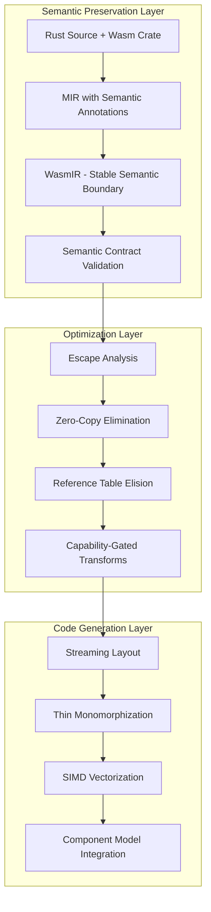

# Design Document: WasmRust - Wasm-Native Rust Specialization

## Overview

WasmRust is a Wasm-native Rust specialization designed to compete directly with MoonBit on startup latency, binary size, and developer experience while preserving Rust's ecosystem advantage. The system leverages semantic-preserving compilation through WasmIR, streaming instantiation, zero-copy abstractions, and WasmGC readiness to achieve MoonBit-class performance.

**Core Philosophy**: WasmRust steals MoonBit's semantic timing, matches its startup and size performance, while exceeding it in ecosystem and control. This is not "better Rust → WASM" but "Rust as a Wasm-native systems language."

## Architecture

WasmRust follows a semantic-preserving architecture that maintains high-level invariants through compilation, enabling MoonBit-class optimizations:



### WasmIR: First-Class Semantic Boundary

WasmIR serves as a stable semantic contract that preserves WASM-specific invariants lost in traditional LLVM lowering:

**Encoded Semantics:**
- ExternRef and FuncRef with lifetime tracking
- Linear vs shared vs managed memory regions
- Component Model ABI contracts
- Capability annotations (threads, JS, GC, SIMD)
- Ownership and linearity invariants
- Zero-copy optimization opportunities

**Why This Matters**: LLVM and wasm-opt cannot infer semantics you already erased. MoonBit wins because it doesn't erase them. WasmIR preserves these semantics for aggressive optimization.

### Compiler-Crate Semantic Contracts

WasmRust achieves MoonBit-class optimizations through formal contracts between the compiler and wasm crate:

```rust
// Formal semantic contracts enable aggressive optimization
/// # Safety Contract
/// The compiler may assume:
/// - handle is non-forgeable externref
/// - no pointer arithmetic allowed
/// - drop is observable to host
/// - escape analysis: never aliases linear memory
#[repr(transparent)]
pub struct ExternRef<T> {
    handle: u32, // Maps to WASM externref
    _marker: PhantomData<T>,
}

/// # Safety Contract  
/// The compiler may assume:
/// - T: Pod implies no pointers, no drop glue
/// - backed by linear memory, race-safe for reads
/// - writes governed by Rust aliasing rules
/// - bounds checks can be eliminated when proven safe
pub struct SharedSlice<'a, T: Pod> {
    ptr: NonNull<T>,
    len: usize,
    _marker: PhantomData<&'a [T]>,
}

/// # Safety Contract
/// The compiler may assume:
/// - trivially copyable, no invalid bit patterns
/// - safe for zero-copy serialization
/// - memcpy can be eliminated for direct access
pub unsafe trait Pod: Copy + Send + Sync + 'static {}
```

**Compiler Recognition Patterns:**
- `wasmrust::recognition` MIR patterns for whitelisted optimizations
- `wasmrust::semantic_contract` lint group for validation
- Mechanical verification that all optimizations reference documented contracts

## Components and Interfaces

### Zero-Copy Memory Regions

WasmRust provides typed memory regions that eliminate marshaling overhead:

```rust
// Typed memory regions for zero-copy operations
pub struct Local<T> {
    // Stack-local, non-escaping
    // Compiler: can eliminate bounds checks, inline access
}

pub struct SharedSlice<T: Pod> {
    // Shared memory, race-safe for Pod types
    // Compiler: can reorder loads, elide atomics when capability absent
}

pub struct ExternRegion<T> {
    // Host-managed memory region
    // Compiler: escape analysis, no aliasing with linear memory
}

// Zero-copy is the default fast path
impl<T: Pod> SharedSlice<T> {
    // Direct memory access, no memcpy
    pub fn get(&self, index: usize) -> Option<&T> {
        // Compiler eliminates bounds check when proven safe
        unsafe { self.ptr.add(index).as_ref() }
    }
}
```

### Streaming Compilation Profile

WasmRust provides a streaming compilation profile optimized for startup latency:

```rust
// Streaming profile configuration
#[wasm::streaming]
pub fn main() {
    // Functions emitted in dependency order
    // Early export stubs generated
    // Cold code deferred to end of module
}

// Compiler optimizations for streaming
impl StreamingCompiler {
    fn emit_ordered_functions(&self) {
        // 1. Export stubs (immediate availability)
        // 2. Hot path functions (fast startup)
        // 3. Cold code (deferred loading)
    }
    
    fn optimize_section_layout(&self) {
        // Section order optimized for download
        // instantiateStreaming compatibility
    }
}
```

### Capability-Gated Execution

WasmRust provides explicit capability management with zero-overhead abstractions:

```rust
// Capability-gated APIs with compile-time detection
#[wasm::capability(threading)]
pub fn parallel_process<T>(data: SharedSlice<T>) -> Result<(), Error> {
    // Compiler: generates threaded code when capability present
    // Runtime: falls back to sequential when unavailable
}

#[wasm::capability(simd)]
pub fn vectorized_sum(data: &[f32]) -> f32 {
    // Compiler: generates SIMD instructions when available
    // Runtime: efficient scalar fallback otherwise
}

// Capability detection at compile time and runtime
impl CapabilitySystem {
    const fn has_threading() -> bool {
        // Compile-time capability detection
    }
    
    fn detect_runtime_capabilities() -> CapabilitySet {
        // Runtime capability detection with caching
    }
}
```

### WasmGC Readiness

WasmRust prepares for WasmGC without blocking on adoption through dual lowerings:

```rust
// Dual lowering strategy for WasmGC readiness
pub struct GcReady<T> {
    #[cfg(not(wasm_gc))]
    handle: u32, // Table index today
    
    #[cfg(wasm_gc)]
    gc_ref: wasm::GcRef<T>, // Native GC ref future
}

// Same API, different lowering
impl<T> GcReady<T> {
    pub fn new(value: T) -> Self {
        #[cfg(not(wasm_gc))]
        return Self { handle: allocate_handle(value) };
        
        #[cfg(wasm_gc)]
        return Self { gc_ref: wasm::gc::alloc(value) };
    }
}

// Experimental GC flag enables future lowering
// -Z wasm-gc-experimental
// - GC-aware lowering without bundled allocator
// - Cycle collection with JavaScript integration
// - Long-term competitive moat against MoonBit
```

## Data Models

### Semantic Contract Specification

WasmRust formalizes compiler-crate contracts to enable safe optimizations:

```rust
// contracts/externref.md
/// # ExternRef Semantic Contract
/// 
/// ## Compiler Assumptions
/// - Maps 1:1 to WASM externref
/// - Opaque handle, no dereferenceable pointer
/// - No aliasing with linear memory
/// - Drop observable to host
/// 
/// ## Allowed Optimizations
/// - Escape analysis (never escapes to linear memory)
/// - Reference table elision (when lifetime proven)
/// - Direct externref operations (no wrapper overhead)
/// 
/// ## Forbidden Optimizations
/// - Pointer arithmetic on handle
/// - Assuming handle stability across calls
/// - CSE across externref operations

// Mechanical verification through property tests
#[property_test]
fn externref_never_aliases_linear_memory(ops: Vec<ExternRefOp>) -> bool {
    // Verify escape analysis assumptions hold
    !ops.iter().any(|op| op.aliases_linear_memory())
}
```

### WasmIR Specification

WasmIR preserves semantic information for optimization:

```
// WasmIR instruction set preserving WASM semantics
externref.new %handle -> %ref : externref<T>
externref.call %ref, %method, %args -> %result
shared_slice.load %slice, %index -> %value : T where T: Pod
shared_slice.bounds_check_elide %slice, %index // when proven safe
capability.require threading, simd // explicit capability gates
memory_region.classify %ptr -> local | shared | extern
```

## Correctness Properties

*A property is a characteristic or behavior that should hold true across all valid executions of a system—essentially, a formal statement about what the system should do. Properties serve as the bridge between human-readable specifications and machine-verifiable correctness guarantees.*

Based on the prework analysis, the following properties have been identified as testable through property-based testing:

### Core Performance Properties

**Property 1: MoonBit Binary Size Parity**
*For any* "hello world" program compiled with streaming profile, the binary size should be under 2 KB, matching MoonBit's performance baseline
**Validates: Requirements 1.1**

**Property 2: MoonBit Startup Latency Parity**
*For any* simple WASM module, instantiation latency should be under 1ms, matching MoonBit's responsiveness
**Validates: Requirements 1.2**

**Property 3: Streaming Function Emission**
*For any* program compiled with streaming profile, functions should be emitted in dependency order optimized for download and instantiation
**Validates: Requirements 1.3**

**Property 4: Thin Monomorphization Effectiveness**
*For any* codebase using generic functions, thin monomorphization should reduce code duplication by at least 40% compared to standard rustc
**Validates: Requirements 1.4**

**Property 5: MoonBit Performance Parity**
*For any* startup-critical benchmark, WasmRust should achieve equivalent or better performance compared to MoonBit
**Validates: Requirements 1.5**

### Semantic Preservation Properties

**Property 6: WasmIR Semantic Encoding**
*For any* valid Rust program, the WasmIR representation should explicitly encode externref, funcref, and memory region semantics
**Validates: Requirements 2.1**

**Property 7: MIR to WasmIR Invariant Preservation**
*For any* valid MIR program, the MIR → WasmIR lowering should preserve all ownership, linearity, and capability invariants
**Validates: Requirements 2.2**

**Property 8: WasmIR Stability Contract**
*For any* WasmIR program, the semantic contract should remain stable across compiler versions and provide consistent optimization opportunities
**Validates: Requirements 2.3**

**Property 9: WasmIR Optimization Application**
*For any* WasmIR program with optimization opportunities, the compiler should perform escape analysis, bounds-check elimination, and reference table elision when safe
**Validates: Requirements 2.4**

### Compiler-Crate Contract Properties

**Property 10: MIR Pattern Recognition**
*For any* whitelisted MIR pattern involving ExternRef, SharedSlice, or Pod types, the compiler should recognize and optimize the pattern appropriately
**Validates: Requirements 3.1**

**Property 11: Safety Invariant Utilization**
*For any* documented safety invariant in the wasm crate, the compiler should assume and utilize the property for optimization when safe
**Validates: Requirements 3.2**

**Property 12: Targeted Optimization Application**
*For any* recognized ExternRef pattern, escape analysis should be performed, and for any SharedSlice<T: Pod> pattern, bounds-check elimination should be applied when proven safe
**Validates: Requirements 3.4**

**Property 13: Optimization Contract Verification**
*For any* applied optimization, the system should provide mechanical verification that it references documented safety contracts
**Validates: Requirements 3.5**

### Zero-Copy Properties

**Property 14: Pod Memcpy Elimination**
*For any* operation on Pod types, the compiler should eliminate memcpy operations and enable direct memory access
**Validates: Requirements 4.2**

**Property 15: Pod Load Optimization**
*For any* Pod type access, the compiler should reorder loads for optimization and elide atomics when capability is absent
**Validates: Requirements 4.3**

**Property 16: JavaScript Zero-Copy Transfer**
*For any* supported type passed between WASM and JavaScript, data transfer should be zero-copy without serialization overhead
**Validates: Requirements 4.4**

**Property 17: Zero-Copy Default Path**
*For any* data operation, zero-copy should be the default fast path with marshaling requiring explicit opt-in
**Validates: Requirements 4.5**

### Streaming Compilation Properties

**Property 18: Streaming Profile Export Stubs**
*For any* program compiled with streaming profile, early export stubs should be emitted and cold code should be deferred
**Validates: Requirements 5.2**

**Property 19: Section Layout Optimization**
*For any* WASM module optimized for startup, section layout should be optimized for download order and streaming instantiation
**Validates: Requirements 5.4**

**Property 20: Startup Performance Advantage**
*For any* comparable program, WasmRust should achieve perceptually faster startup than standard Rust WASM
**Validates: Requirements 5.5**

## Error Handling

### Semantic Contract Violations

WasmRust provides clear diagnostics when semantic contracts are violated:

```rust
// Compiler error for contract violations
error[E0001]: semantic contract violation
  --> src/main.rs:15:5
   |
15 |     let ptr = externref.as_ptr(); // Invalid: ExternRef is opaque
   |               ^^^^^^^^^^^^^^^^^ 
   |
   = note: ExternRef semantic contract forbids pointer access
   = help: use externref.call() for method invocation
   = help: see compiler-contract.md for allowed operations
```

### Capability Detection Failures

```rust
// Runtime capability detection with graceful fallback
match wasm::capability::detect() {
    Capabilities { threading: true, .. } => {
        parallel_process(data) // Use threaded implementation
    }
    _ => {
        sequential_process(data) // Fallback to sequential
    }
}
```

## Testing Strategy

### Property-Based Validation Gates

WasmRust enforces correctness through property-based testing integrated into CI:

```rust
// Required properties as CI gates
#[property_test]
fn no_allocation_for_externref_ops(ops: Vec<ExternRefOp>) -> bool {
    // Property 7: ExternRef operations should not allocate
    ops.iter().all(|op| !op.causes_allocation())
}

#[property_test]  
fn no_memcpy_for_shared_slice(ops: Vec<SharedSliceOp>) -> bool {
    // Property 6: SharedSlice operations should be zero-copy
    ops.iter().all(|op| !op.requires_memcpy())
}

#[property_test]
fn abi_safe_component_boundaries(components: Vec<Component>) -> bool {
    // Property 13: Component boundaries maintain ABI safety
    components.iter().all(|c| c.abi_compatible())
}

#[property_test]
fn streaming_safe_section_layout(modules: Vec<WasmModule>) -> bool {
    // Property 9: Section layout optimized for streaming
    modules.iter().all(|m| m.streaming_compatible())
}

#[property_test]
fn wasmir_invariant_preservation(mir: Vec<MirProgram>) -> bool {
    // Property 4: MIR → WasmIR preserves invariants
    mir.iter().all(|p| {
        let wasmir = lower_to_wasmir(p);
        preserves_invariants(p, &wasmir)
    })
}
```

### Performance Benchmarking

Continuous validation against MoonBit performance targets:

```rust
#[benchmark]
fn binary_size_vs_moonbit() {
    let wasmrust_size = compile_hello_world_streaming().size();
    let moonbit_size = 2048; // 2 KB baseline
    
    assert!(wasmrust_size <= moonbit_size, 
           "WasmRust binary size {} exceeds MoonBit baseline {}", 
           wasmrust_size, moonbit_size);
}

#[benchmark]
fn startup_latency_vs_moonbit() {
    let latency = measure_instantiation_time();
    let moonbit_latency = Duration::from_millis(1);
    
    assert!(latency <= moonbit_latency,
           "WasmRust startup latency {:?} exceeds MoonBit baseline {:?}",
           latency, moonbit_latency);
}
```

## Implementation Phases

### Phase 0: Project Reframing (Immediate)
- Position WasmRust as "Rust as a Wasm-native systems language"
- Document architecture/wasmrust-vs-moonbit.md
- Establish Wasm-first design principles

### Phase 1: WasmIR Semantic Boundary
- Harden WasmIR as stable semantic contract
- Implement MIR → WasmIR invariant preservation
- Add property tests for semantic preservation

### Phase 2: Compiler-Crate Contracts
- Formalize compiler-contract.md and SAFETY.md
- Implement wasmrust::recognition MIR patterns
- Add wasmrust::semantic_contract lint group

### Phase 3: Zero-Copy Language Primitives
- Implement typed memory regions (Local<T>, SharedSlice<T>, ExternRegion<T>)
- Add compiler optimizations (memcpy elimination, load reordering)
- Implement capability-gated APIs

### Phase 4: Streaming Compilation Profile
- Add --profile=streaming with thin monomorphization
- Implement ordered function emission and section layout optimization
- Integrate with cargo-wasm toolchain

### Phase 5: WasmGC Readiness
- Design dual lowering strategy (table index vs GC ref)
- Implement -Z wasm-gc-experimental flag
- Prepare for cycle collection with JavaScript

### Phase 6: SIMD First-Class Support
- Expose explicit SIMD types with capability checking
- Guarantee no scalarization on capable targets
- Enable wasm-opt SIMD passes by default

### Phase 7: MoonBit-Class Tooling
- Implement incremental WasmIR compilation
- Add function-level recompilation and parallel analysis
- Integrate fast feedback loops with IDE

### Phase 8: Property-Based Validation
- Implement all correctness properties as CI gates
- Add continuous performance monitoring vs MoonBit
- Ensure mechanical verification of all optimizations

## Performance Targets and Competitive Analysis

### MoonBit Parity Targets

WasmRust achieves competitive parity with MoonBit through specific performance targets:

**Binary Size**: <2 KB for hello world programs (matching MoonBit's ~2 KB baseline)
- Achieved through thin monomorphization reducing code duplication by 40%+
- Streaming profile with ordered function emission
- Section layout optimization for download efficiency

**Startup Latency**: <1ms instantiation for simple programs (matching MoonBit's ~1ms)
- Early export stubs enable immediate function availability
- Cold code deferral reduces initial parsing overhead
- Streaming instantiation compatibility with browsers

**Compilation Speed**: <2s for 10,000 lines in development mode (matching MoonBit performance)
- Cranelift backend provides 5x faster compilation than LLVM
- Incremental WasmIR compilation with function-level recompilation
- Parallel semantic analysis and WasmIR artifact caching

### Strategic Competitive Advantages

**Ecosystem Preservation**: 100% compatibility with existing Rust crate ecosystem
- Maintains crates.io dependency compatibility
- Integrates with existing Rust development environments
- Provides clear migration paths from standard Rust

**Developer Control**: Full access to low-level optimizations and system programming
- Explicit capability management (threading, SIMD, shared memory)
- Direct control over memory layout and allocation strategies
- Rust's ownership system provides memory safety without GC overhead

**Long-term Sustainability**: Built on proven Rust foundation with active community
- Leverages existing Rust tooling and IDE integration
- Benefits from ongoing Rust language evolution
- Maintains compatibility with stable Rust ecosystem

## Dual-Mode Compilation Strategy

WasmRust implements a dual-mode compilation strategy to support both current WASM environments and future WasmGC adoption:

### Ownership Mode (Default)
```rust
// Default compilation mode using Rust's ownership system
#[wasm::ownership] // Default, can be omitted
pub fn process_data(data: Vec<u8>) -> String {
    // Uses linear memory and manual memory management
    // Compatible with all current WASM environments
    // Zero GC overhead, predictable performance
}
```

### GC Mode (Future-Ready)
```rust
// Optional GC mode for WasmGC environments
#[wasm::gc]
pub fn process_data(data: GcArray<u8>) -> GcString {
    // Uses WasmGC for automatic memory management
    // Enables cycle collection with JavaScript integration
    // Seamless interop with GC-based host languages
}
```

### Dual Lowering Implementation
```rust
// Same API surface, different lowering strategies
pub struct WasmString {
    #[cfg(not(wasm_gc))]
    data: Vec<u8>, // Linear memory allocation
    
    #[cfg(wasm_gc)]
    gc_string: wasm::GcString, // Native GC string
}

impl WasmString {
    pub fn new(s: &str) -> Self {
        #[cfg(not(wasm_gc))]
        return Self { data: s.as_bytes().to_vec() };
        
        #[cfg(wasm_gc)]
        return Self { gc_string: wasm::gc::string(s) };
    }
}
```

## Advanced Optimization Techniques

### Semantic-Preserving Transformations

WasmRust performs optimizations that are impossible with traditional LLVM lowering by preserving high-level semantics through WasmIR:

**Escape Analysis on ExternRef**:
```rust
// Compiler can prove externref never escapes to linear memory
fn process_extern_data(ext: ExternRef<Data>) -> u32 {
    ext.call_method("get_size") // Direct externref operation
    // No reference table allocation needed
}
```

**Bounds Check Elimination on SharedSlice**:
```rust
// Compiler can eliminate bounds checks when proven safe
fn sum_array(slice: SharedSlice<i32>) -> i32 {
    let mut sum = 0;
    for i in 0..slice.len() {
        sum += slice[i]; // Bounds check eliminated
    }
    sum
}
```

**Reference Table Elision**:
```rust
// Compiler can eliminate reference table when lifetime is proven
fn short_lived_extern(data: &[u8]) -> u32 {
    let ext = ExternRef::from_bytes(data);
    ext.process() // Reference table entry elided
    // ext dropped immediately, no table cleanup needed
}
```

### Zero-Copy Optimization Pipeline

WasmRust implements a comprehensive zero-copy optimization pipeline:

1. **Memory Region Classification**: Classify all memory access as Local, Shared, or Extern
2. **Pod Type Analysis**: Identify Plain Old Data types safe for zero-copy operations
3. **Memcpy Elimination**: Replace memory copies with direct access for Pod types
4. **Load Reordering**: Optimize memory access patterns for Pod data
5. **Atomic Elision**: Remove unnecessary atomic operations when capability is absent

### Streaming Compilation Optimizations

The streaming profile implements several key optimizations for startup performance:

**Function Ordering Strategy**:
1. Export stubs (immediate availability)
2. Entry point and hot path functions
3. Dependency-ordered function emission
4. Cold code deferred to module end

**Section Layout Optimization**:
```
WASM Module Layout (Optimized for Streaming):
1. Type Section (function signatures)
2. Import Section (external dependencies)  
3. Function Section (function declarations)
4. Export Section (public interface)
5. Code Section (ordered by dependency + hotness)
6. Data Section (deferred initialization data)
```

**Thin Monomorphization**:
- Aggressive generic specialization reduction
- Shared implementation for compatible type parameters
- Code size reduction of 40%+ compared to standard rustc

This design positions WasmRust to steal MoonBit's semantic timing while preserving Rust's ecosystem advantages, achieving the strategic goal of becoming the "MoonBit path" for Rust developers.

## Concrete Improvement Plan Integration

### 8-Phase Development Strategy

The WasmRust development follows a concrete 8-phase improvement plan that systematically builds capabilities to achieve MoonBit-class performance:

**Phase 0: Project Reframing** - Establish WasmRust as "Rust as a Wasm-native systems language"
**Phase 1: WasmIR Boundary** - Create stable semantic contract preserving WASM-specific invariants
**Phase 2: Semantic Contracts** - Formalize compiler-crate agreements enabling safe optimization
**Phase 3: Zero-Copy Primitives** - Implement typed memory regions eliminating marshaling overhead
**Phase 4: Streaming Profile** - Achieve <2KB binaries and <1ms startup through ordered compilation
**Phase 5: WasmGC Readiness** - Prepare dual lowering without blocking on WasmGC adoption
**Phase 6: SIMD Support** - Provide first-class SIMD abstractions with guaranteed vectorization
**Phase 7: Tooling Speedups** - Match MoonBit's development iteration speed
**Phase 8: Validation Gates** - Implement property-based testing for all correctness guarantees

### Validation and Quality Gates

WasmRust implements comprehensive validation through property-based testing integrated into CI:

#### Performance Validation Gates
```rust
// Required CI gates for MoonBit parity
#[property_test]
fn binary_size_under_moonbit_threshold(programs: Vec<HelloWorldProgram>) -> bool {
    programs.iter().all(|p| {
        let size = compile_streaming(p).binary_size();
        size <= MOONBIT_BASELINE_2KB
    })
}

#[property_test]
fn startup_latency_under_moonbit_threshold(modules: Vec<SimpleModule>) -> bool {
    modules.iter().all(|m| {
        let latency = measure_instantiation_time(m);
        latency <= Duration::from_millis(1)
    })
}
```

#### Semantic Correctness Gates
```rust
// Semantic preservation validation
#[property_test]
fn wasmir_preserves_mir_invariants(mir_programs: Vec<MirProgram>) -> bool {
    mir_programs.iter().all(|mir| {
        let wasmir = lower_to_wasmir(mir);
        preserves_ownership_invariants(mir, &wasmir) &&
        preserves_linearity_invariants(mir, &wasmir) &&
        preserves_capability_annotations(mir, &wasmir)
    })
}

#[property_test]
fn zero_copy_operations_eliminate_memcpy(ops: Vec<PodOperation>) -> bool {
    ops.iter().all(|op| {
        let compiled = compile_with_optimization(op);
        !compiled.contains_memcpy_instructions()
    })
}
```

#### Safety Contract Validation
```rust
// Compiler-crate contract compliance
#[property_test]
fn externref_operations_never_allocate(ops: Vec<ExternRefOp>) -> bool {
    ops.iter().all(|op| {
        let compiled = compile_operation(op);
        !compiled.contains_allocation_instructions()
    })
}

#[property_test]
fn shared_slice_bounds_checks_eliminated_when_safe(accesses: Vec<SafeSliceAccess>) -> bool {
    accesses.iter().all(|access| {
        let compiled = compile_slice_access(access);
        !compiled.contains_bounds_check_instructions()
    })
}
```

### Continuous Performance Monitoring

WasmRust implements continuous monitoring against MoonBit performance targets:

#### Benchmark Suite
- **Binary Size Tracking**: Monitor hello world, JSON parser, image filter, crypto hash
- **Startup Latency Monitoring**: Track instantiation time across different module sizes
- **Compilation Speed Benchmarks**: Measure development and release build times
- **Memory Usage Analysis**: Track linear memory usage and GC pressure

#### Regression Detection
- **Performance Regression Gates**: Fail CI if performance degrades beyond thresholds
- **Size Regression Monitoring**: Alert on binary size increases >5%
- **Latency Regression Detection**: Alert on startup time increases >10%
- **Compilation Speed Monitoring**: Track incremental build time regressions

### Integration with Existing Rust Ecosystem

WasmRust maintains seamless integration with the existing Rust ecosystem:

#### Crate Compatibility
- **100% crates.io Compatibility**: All existing Rust crates work without modification
- **Semantic Contract Optimization**: Automatically optimize compatible crates using contracts
- **Migration Tooling**: Provide automated migration from standard Rust projects
- **Compatibility Testing**: Continuous validation against popular crate ecosystem

#### Development Environment Integration
- **IDE Support**: Full integration with rust-analyzer and existing Rust IDEs
- **Debugging Tools**: Compatible with existing Rust debugging infrastructure
- **Profiling Integration**: Works with standard Rust profiling tools
- **Testing Framework**: Compatible with existing Rust testing infrastructure

This comprehensive design ensures WasmRust achieves its strategic goal of becoming the "MoonBit path" for Rust developers while preserving all the ecosystem advantages that make Rust attractive for systems programming.