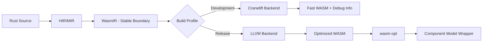

# WasmRust — A Rust-to-WebAssembly Compiler Toolchain

## Overview

**WasmRust** is a specialized toolchain for compiling Rust to WebAssembly, designed to enhance Rust's capabilities for WebAssembly targets. It provides a layered architecture that enables:

*   **Minimal Binary Sizes:** Advanced optimizations to reduce the footprint of your Wasm modules.
*   **Fast Compilation Times:** A Cranelift-based backend for rapid development builds.
*   **Seamless Integration:** First-class support for the WebAssembly Component Model.
*   **Efficient JavaScript Interop:** Low-overhead communication between Rust and JavaScript.
*   **Full Rust Memory Safety:** All of Rust's compile-time safety guarantees are preserved.

WasmRust is an **extension of the Rust compiler and its ecosystem**, fully compatible with the standard Rust compiler (`rustc`) and the crates.io ecosystem. It is not a new language, but rather a specialized backend for `rustc`.

WasmRust leverages:

*   **Cranelift** for fast, unoptimized development builds.
*   **LLVM** for highly optimized release builds.
*   **Wasm-native type abstractions** to eliminate the impedance mismatch between Rust's ownership model and WebAssembly's execution environment.

> **Key principle:** WasmRust is `rustc` with a focus on WebAssembly, not a new language.

## Repository Structure

```
wasmrust/
├── compiler/                # rustc extensions & backends
│   ├── codegen-cranelift/   # WASM-tuned Cranelift backend
│   ├── codegen-llvm/        # WASM-optimized LLVM backend
│   ├── verifier/            # Invariant checker pass [planned]
│   └── lints/               # wasm-recognition lint group [planned]
│
├── crates/
│   ├── wasm/                # Core zero-cost WASM abstractions
│   └── wasm-macros/         # Proc macros (Component Model / WIT) [planned]
│
├── tooling/
│   └── cargo-wasm/          # WASM-aware Cargo frontend [planned]
│
├── docs/
│   ├── SAFETY.md            # Unsafe invariants per type / crate
│   ├── compiler-contract.md # Formal compiler ↔ crate contracts
│   ├── RFCs/
│   └── architecture/
│
└── README.md
```

> Each crate has its own `README.md` and `SAFETY.md` files that describe its unsafe invariants and compiler contracts.

## What is WasmRust?

WasmRust is a **specialized Rust toolchain** that:

*   **Preserves the Rust frontend:** The parser, HIR, MIR, and borrow checker remain unchanged.
*   **Replaces the code generation backend:** WasmRust provides its own code generation backends optimized for WebAssembly.
*   **Provides library-level primitives:** The `crates/wasm` crate provides a set of zero-cost abstractions that map directly to WebAssembly concepts.
*   **Enables opt-in Wasm features:** Advanced WebAssembly features can be enabled without fragmenting the Rust language.

```text
rustc frontend (parser, HIR, MIR, borrow checking) → unchanged
           │
           ▼
Wasm-specialized codegen
 ┌───────────────┬───────────────┐
 │ Cranelift WASM │ LLVM WASM    │
 │ (dev builds)   │ (release)    │
 └───────────────┴───────────────┘
           ▼
crates/wasm (zero-cost APIs: externref, threads, components, memory)
```

## The `crates/wasm` Core Library

The `wasm` crate is the foundation of WasmRust. It is:

*   `no_std` by default.
*   Dependency-free.
*   Runtime-free.
*   Compiler-agnostic, meaning it works on stable Rust today.

The crate provides zero-cost abstractions over WebAssembly primitives that the WasmRust compiler can recognize and optimize.

**Crate Metadata**:

```toml
[package]
name = "wasm"
version = "0.1.0"
edition = "2021"
license = "MIT OR Apache-2.0"
description = "Zero-cost WebAssembly abstractions for Rust"
```

**Location:** `crates/wasm`

### Why a Separate Crate?

*   Most WebAssembly semantics are best expressed at the library level, not within the compiler.
*   It allows for the explicit modeling of WebAssembly concepts, such as `externref`, shared memory, and components.
*   It enables stable Rust users to adopt Wasm-first APIs today.
*   It provides a semantic hook for the compiler to perform optimizations.
*   This approach mirrors the evolution of `core`, `alloc`, and `std` as a set of layered abstractions.

## Compiler ↔ Crate Contract

The WasmRust compiler assumes certain invariants when compiling code that uses `crates/wasm`:

*   `ExternRef<T>` and `FuncRef` are opaque handles with valid lifetime markers.
*   `SharedSlice<T>` contains only `Pod` types; aliasing and bounds are enforced.
*   Linear types (`#[wasm::linear]`) follow move semantics; the compiler assumes no implicit copies.
*   Component imports/exports use WIT-derived types; the ABI must match exactly.

Unsafe operations must maintain the invariants documented in `SAFETY.md`. Compiler passes, such as the verifier, will enforce these invariants at the MIR and WasmIR levels. The `wasm-recognition` lint group will detect misuses, such as:

*   `ExternRef` escaping a valid lifetime.
*   Non-`Pod` types in `SharedSlice`.
*   Invalid Component ABI usage.

## Compiler Extension Goals

WasmRust extends Rust at the code generation and optimization boundaries, not at the syntax level.

### Codegen Backends

*   **Cranelift (for development):**
    *   5–10× faster compilation times.
    *   Optimized for iteration speed.
    *   Ideal for continuous integration and inner development loops.
*   **LLVM (for release):**
    *   Aggressive size and performance optimizations.
    *   Wasm-specific optimization passes.
    *   Emission of Component Model metadata.

> Both backends compile the same Rust source code.

## Opt-In Wasm Features

Advanced features are opt-in and can be enabled via:

*   Cargo features (e.g., `threads`, `component-model`).
*   Unstable compiler flags (e.g., `-Z wasm-*`).
*   Explicit imports from the `crates/wasm` crate.

Examples of opt-in features include:

*   Structured WebAssembly threading.
*   Linear resource handling.
*   Component Model ABI validation.
*   Thin monomorphization for minimal binary size.

## What Works Without WasmRust?

Everything in the `crates/wasm` crate:

*   Compiles on stable Rust.
*   Produces valid WebAssembly.
*   Has no dependency on a custom compiler.

> WasmRust enhances, but is not required for, the functionality in `crates/wasm`.

## What Requires the WasmRust Compiler?

*   Native Component Model emission.
*   Cranelift-accelerated development builds.
*   Wasm-aware thin monomorphization.
*   Compiler-verified ABI and layout guarantees.
*   Profile-guided optimization tuned specifically for WebAssembly.

> These features cannot be achieved with a library alone.

## Non-Goals

WasmRust is **not**:

*   A fork of the Rust language.
*   A new language.
*   A replacement for `wasm-bindgen` (at least not initially).
*   A JavaScript framework.
*   A runtime.

The focus of WasmRust is on **compilation correctness, binary size, and iteration speed**.

## Architecture

```mermaid
graph TB
    subgraph "Layer 5: Tooling & Distribution"
        A[cargo-wasm CLI [planned]]
        B[Registry Federation]
        C[Debug Tools]
        D[Profiler]
    end

    subgraph "Layer 4: Compiler Backend"
        E[Cranelift Backend]
        F[LLVM Backend]
        G[Profile-Guided Optimization]
        H[Verifier Pass [planned]]
        I[wasm-recognition Lints [planned]]
    end

    subgraph "Layer 3: Runtime Services"
        J[Memory Management]
        K[Threading Runtime]
        L[Component Linking]
    end

    subgraph "Layer 2: Language Extensions"
        M[Component Model Macros]
        N[WIT Integration]
        O[Capability Annotations]
    end

    subgraph "Layer 1: Core Language"
        P[WASM Native Types]
        Q[Linear Types]
        R[Safe Abstractions]
    end

    A --> E
    A --> F
    E --> J
    F --> J
    H --> E
    H --> F
    I --> H
    M --> P
    N --> Q
    J --> R
```

### Language Surface Contract

*   **Core (80%):** The standard Rust compiler with a custom code generation backend.
*   **Extensions (15%):** The `wasm` crate and procedural macros for WebAssembly features.
*   **Compiler Plugins (4%):** Unstable (`-Z`) flags for optimizations.
*   **Hard Fork (<1%):** Minimal incompatible changes, only if absolutely necessary.

> **Compatibility:** Standard Rust code compiles unchanged. Wasm-specific features are opt-in.
> **Migration Path:** A six-month deprecation window with automatic migration tools will be provided if upstream Rust introduces conflicting changes.

### Host Profile Support

| Host Profile | Threading                     | JS Interop      | Component Model | Memory Regions |
| ------------ | ----------------------------- | --------------- | --------------- | -------------- |
| Browser      | `SharedArrayBuffer` + COOP/COEP | Direct calls    | Partial         | No             |
| Node.js      | Worker threads                | Native bindings | Polyfill        | No             |
| Wasmtime     | wasi-threads                  | Host functions  | Full            | Configurable   |
| Embedded     | No                            | No              | Partial         | No             |

> Performance guarantees apply only to supported profiles.

## Compilation Pipeline



**WasmIR** encodes:

*   Linear memory operations with bounds checking.
*   Reference types (`externref`, `funcref`) with lifetime tracking.
*   Component Model calling conventions.
*   Capability annotations for optimization.
*   Ownership and linearity invariants.

## Core Features (with Contracts)

*   **WASM Native Types (`ExternRef`, `FuncRef`)**

    ```rust
    #[repr(transparent)]
    pub struct ExternRef<T> { handle: u32, _marker: PhantomData<T> }
    #[repr(transparent)]
    pub struct FuncRef { handle: u32 }
    pub struct SharedSlice<'a, T: wasm::Pod> { ptr: *const T, len: usize, _marker: PhantomData<&'a [T]> }
    ```

    *   Compiler assumes valid lifetimes and opaque handles.
*   **Linear Types (`#[wasm::linear]`)**

    ```rust
    #[wasm::linear]
    struct CanvasContext(wasm::Handle);
    ```

    *   No implicit copies; moves enforce linearity.
*   **`SharedSlice<T>`**
    *   Only `Pod` types; bounds are statically verified.
*   **Component Model**
    *   ABI contracts enforced by compiler and verifier.

### Language Extensions

*   **Component Model Integration:** `#[wasm::component]` and WIT bindings.
*   **Capability Annotations:** For threading, JS interop, and memory optimization.

### Runtime Services

*   **Memory Management:** Scoped arenas and host-validated memory regions.
*   **Threading Runtime:** Structured concurrency with automatic cleanup.

### Compiler Backend

*   **Dual Backend:** Cranelift for development and LLVM for release.
*   **Profile-Guided Optimization:** For hot paths and code layout.

## Testing and Verification

*   **Property-Based Testing:** For binary size, monomorphization, ownership enforcement, and threading safety.
*   **Cross-Language ABI Testing:** With Zig, C, and other WebAssembly components.
*   **Reproducible Builds:** Deterministic compilation profiles.
*   **Performance Benchmarks:** For JS interop and threading.

## Governance and Direction

*   Upstream-friendly design.
*   Library APIs stabilize before compiler features.
*   Avoids ecosystem fragmentation.
*   RFC-driven feature evolution.

## Where to Start

*   📦 Use `crates/wasm` for low-level WASM code today.
*   📖 Read tech specs in [`docs/TSD-WasmRust.md`](docs/TSD-WasmRust.md).
*   🧪 Experiment with Cranelift WASM builds (nightly).
*   🛠️ Contribute to core abstractions before compiler work.
