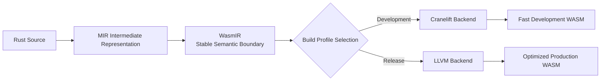
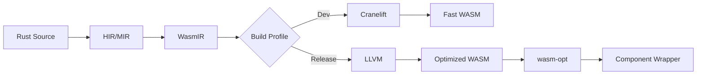

# WasmRust

> Native Rust for Systems, GC-Ready Rust for WebAssembly

## Overview

**WasmRust is not just "Rust → WASM tooling."**
It represents a **systems-grade Rust specialization** that treats **WebAssembly as a first-class target machine**, not merely a secondary compilation backend.

> **Native Rust for systems.
> GC-ready Rust for WebAssembly.**

WasmRust maintains full compatibility with **standard Rust semantics, tooling, and ecosystem**, while enabling **WASM-native execution models** — including future **WasmGC** support — without requiring a new language or a fork of Rust.

---

## ✨ Motivation

Despite Rust’s dominance in the WASM ecosystem (`wasmtime`, `wasmer`, `wit-bindgen`), developers face:

* **Large binaries** – even simple programs can be 35 KB; alternative WASM-first languages can be smaller.
* **Slow compilation** – LLVM backend + borrow checking slows iteration.
* **JS interop friction** – glue layers add overhead and complexity.
* **Steep learning curve** – ownership and lifetimes can be barriers.
* **WASM Component Model misalignment** – Rust semantics do not always map cleanly to WASM interfaces.

WasmRust asks:

> *What would Rust look like if WASM were a first-class execution model?*

---

## What Problem Does WasmRust Solve?

Rust excels in traditional systems programming domains:
* Native systems development
* Zero-cost abstractions
* Memory safety without garbage collection

However, WebAssembly introduces unique execution characteristics:
* Reference types (`externref`, `funcref`)
* Linear memory regions
* Component Model ABIs
* Streaming compilation requirements
* Optional garbage collection (WasmGC)

Conventional Rust→WASM compilation pipelines **often erase these semantics prematurely**, resulting in:
* Heavy JavaScript glue code
* Runtime indirection overhead
* Lost optimization opportunities
* Slow development iteration cycles

**WasmRust addresses these issues by aligning Rust's compilation model with the WebAssembly virtual machine.**
---

## What Is WasmRust?

WasmRust is a **Rust compiler extension + crate ecosystem** that provides:

* **WASM-native type abstractions**  
* **Rapid development builds using Cranelift**
* **Highly optimized release builds using LLVM**
* **Stable semantic boundary (WasmIR)**
* **Compiler-verified safety and ABI invariants**
* **Component Model readiness and GC compatibility**

```
WasmRust = rustc + WASM specialization
```

---

## Native Rust vs GC-Ready Rust (Mental Model)

| Domain         | Execution Model                                  |
| -------------- | ------------------------------------------------ |
| Native systems | **Rust owns memory explicitly**                  |
| WASM today     | **Linear memory + reference tables**             |
| WASM future    | **GC-managed references + component model**      |

WasmRust enables writing **a single Rust codebase** that:
* Executes as **native systems Rust**
* Compiles to **WASM with explicit semantic modeling**
* Naturally evolves toward **WasmGC compatibility**

---

## Repository Structure

```
wasmrust/
├── compiler/                        # rustc extensions & backends
│   ├── codegen-cranelift/           # Fast WASM development builds
│   ├── codegen-llvm/                # Optimized WASM release builds
│   ├── verifier/                    # Semantic invariant validation
│   └── lints/                       # wasm-specific lint infrastructure
│
├── crates/
│   ├── wasm/                        # WASM-native zero-cost abstractions
│   └── wasm-macros/                 # Component Model & WIT macros
│
├── tooling/
│   └── cargo-wasm/                  # WASM-aware Cargo integration
│
├── docs/
│   ├── SAFETY.md                    # Authoritative unsafe invariants
│   ├── compiler-contract.md         # Compiler ↔ crate guarantees
│   ├── RFCs/
│   └── architecture/
│
└── README.md
```

---

## crates/wasm — The Semantic Foundation

The `wasm` crate defines **WASM-native Rust abstractions**:

* `ExternRef<T>` — host-managed reference types
* `FuncRef` — callable function references
* `SharedSlice<T: Pod>` — safe shared linear memory access
* Linear types (`#[wasm::linear]`)
* Capability-aware threading and memory APIs

**Key design properties:**
* `no_std` compatible by default
* Zero runtime overhead
* Stable Rust compatible
* Compiler-recognizable semantic patterns

> The compiler leverages documented invariants to enable aggressive optimization of code using these types.

---

## Safety & Compiler Contracts

WasmRust formalizes unsafe behavior rather than obscuring it.

### SAFETY.md Documentation
* Defines **precise unsafe invariants per type**
* Serves as authoritative reference for correctness
* Shared understanding between library users and compiler developers

### Compiler Contract System
* The compiler assumes documented type invariants
* Violations are detected through multiple mechanisms:
  * MIR-level verification passes
  * `wasm-recognition` lint infrastructure
  * Property-based test validation

This enables **powerful optimizations while maintaining soundness guarantees**.

---

## Compilation Model



**WasmIR encodes critical semantic information:**
* Reference type semantics
* Memory region constraints
* Component ABI requirements
* Ownership and linearity properties
* Capability-based security constraints

---

## Why Cranelift + LLVM Dual Backend?

* **Cranelift** → rapid iteration, CI testing, development workflows
* **LLVM** → maximum runtime performance and binary size optimization

Both backends compile the **identical Rust source code** and respect the same semantic contracts.

---

## What Makes WasmRust Different?

| Characteristic               | WasmRust |
| ---------------------------- | -------- |
| Requires new language        | ❌        |
| Rust language fork           | ❌        |
| JavaScript-centric design    | ❌        |
| WASM-native semantic modeling| ✅        |
| GC-ready architecture        | ✅        |
| Zero-cost abstractions       | ✅        |
| Compiler-verified invariants | ✅        |

---

## Target Audience

* Systems engineers targeting WebAssembly deployment
* Rust teams encountering WASM performance or iteration limitations
* Component Model and multi-language WASM system developers
* Future-proof WASM application developers (GC, components, streaming)

---

## Getting Started

* 📦 Use `crates/wasm` on stable Rust today
* 📖 Study `docs/SAFETY.md` and `compiler-contract.md` documentation
* 🧪 Experiment with Cranelift development builds (requires nightly)
* 🧠 Contribute to semantic invariant definitions before backend development

---

## Core Principle

> **WasmRust does not ask Rust to become a garbage-collected language.**
> **It enables Rust to correctly target a garbage-collected machine.**

This distinction represents the fundamental project philosophy.

---
## 🏗 Architecture Overview

WasmRust is structured as a **five-layer stack**:

```
┌─────────────────────────────┐
│ Layer 5 — Tooling & Ecosystem│
│ Registries, debugging, profiler│
├─────────────────────────────┤
│ Layer 4 — Compiler           │
│ WasmIR, Cranelift, LLVM, PGO│
├─────────────────────────────┤
│ Layer 3 — Runtime Semantics  │
│ Multi-memory, regions, threads│
├─────────────────────────────┤
│ Layer 2 — Component Model    │
│ WIT-native imports/exports   │
├─────────────────────────────┤
│ Layer 1 — Core Language      │
│ Linear types, effects, concurrency│
└─────────────────────────────┘
```

---

### The 5 Layers in Detail

#### Layer 1 — Core Language Extensions & `crates/wasm`

The foundation of WasmRust is the `crates/wasm` library. It is `no_std`, dependency-free, runtime-free, and compiler-agnostic. Most WASM semantics belong at the library boundary, providing the compiler with semantic hooks for optimization and allowing stable Rust users to adopt WASM-first APIs today.

* **Linear Types**: Enforce use-once semantics for WASM resources to prevent leaks.
  ```rust
  #[wasm::linear]
  struct CanvasContext(wasm::Handle);

  impl CanvasContext {
      fn draw(&mut self) { /* ... */ }
      // This consuming method moves ownership, preventing further use.
      fn into_bitmap(self) -> ImageData { /* ... */ }
  }
  ```
* **Structured Concurrency**: Scoped threads with automatic joining and lifetime-bound safety.
  ```rust
  use wasm::thread::scope;

  #[wasm::export]
  fn parallel_transform(data: SharedSlice<f32>) -> Result<(), Error> {
      scope(|s| {
          for chunk in data.chunks(1000) {
              s.spawn(|| process(chunk)); // Lifetime tied to scope
          }
          // All threads are automatically joined here
      })?;
      Ok(())
  }
  ```
* **Effect System**: Track side effects like JS calls or I/O at the type level to enable optimizations like dead-effect elimination.
  ```rust
  #[wasm::effect(js_call, atomic_read)]
  fn fetch_and_cache(url: &str) -> Result<Vec<u8>, Error> {
      let data = js::fetch(url)?;
      CACHE.store(url, data);
      Ok(data)
  }
  ```

#### Layer 2 — Component Model

Treats WIT as a first-class interface, enabling type-safe, bidirectional Rust ↔ WASM code generation without glue code.

```rust
#[wasm::wit]
interface crypto {
    resource key-pair {
        constructor(algorithm: string);
        sign: func(data: bytes) -> bytes;
    }
}
```

#### Layer 3 — Runtime Semantics

*   **Multi-region memory**: First-class support for data residency and isolation.
*   **Streaming compilation hints**: Optimize binary layout for faster Time-to-Interactive in browsers.

#### Layer 4 — Compiler Strategy

*   **Cranelift-first dev builds** for fast iteration (~2s for 10k LOC).
*   **LLVM release builds** for aggressive optimizations, `wasm-opt`, and Profile-Guided Optimization.
*   **WasmIR**: A stable intermediate representation that captures linearity, reference types, and ownership invariants.

#### Layer 5 — Tooling & Ecosystem

*   **Federated registries** to avoid centralized lock-in and geopolitical restrictions.
*   **WASM-aware debugging tools** for memory visualization and inspection.

---

## Core Features

| Feature           | Description                                              |
| ----------------- | -------------------------------------------------------- |
| WASM-native types | `ExternRef`, `FuncRef`, `SharedSlice`, `Pod`             |
| Linear types      | Enforce move-only semantics for WASM resources           |
| Component Model   | Compiler-verified ABI, WIT bindings                      |
| JS Interop        | Zero-copy, predictable boundary cost                     |
| Threading         | Scoped concurrency, fallback in unsupported environments |

---

## Compilation Pipeline


---
## Repository Structure

```
wasmrust/
├── compiler/                # rustc extensions & backends
│   ├── codegen-cranelift/   # WASM-tuned Cranelift backend
│   └── codegen-llvm/        # WASM-optimized LLVM backend
│
├── crates/
│   ├── wasm/                # Core zero-cost WASM abstractions
│   └── wasm-macros/         # Proc macros for Component Model / WIT [planned]
│
├── tooling/
│   └── cargo-wasm/          # WASM-aware Cargo frontend [planned]
│
├── docs/
│   ├── SAFETY.md            # Unsafe invariants per type / crate
│   ├── compiler-contract.md # Formal compiler ↔ crate contracts
│   ├── RFCs/
│   └── architecture/
│
└── ReadMe.md
```
---

## Incremental Adoption

#### What Works Without WasmRust?
Everything in `crates/wasm`: it compiles on **stable Rust**, produces valid WASM, and has no dependency on a custom compiler. WasmRust **enhances**, but does not gate, functionality.

#### What Requires the WasmRust Compiler?
Native Component Model emission, Cranelift-accelerated builds, and advanced optimizations like PGO and WASM-aware thin monomorphization. These cannot be achieved from a library alone.

---

## Contracts & Governance

*   **Language Surface Contract**: Core (80%): Standard Rust; Extensions (15%): `wasm` crate; Plugins (4%): `-Z` flags; Hard Fork (<1%): Minimal changes if required.
*   **Compiler ↔ Crate Contract**: The compiler assumes invariants for types like `ExternRef` and `SharedSlice` which are documented in `SAFETY.md` and checked by compiler passes.
*   **Governance & Direction**: Upstream-friendly, library-first stabilization, and RFC-driven evolution.

---

## Notes on SAFETY.md

* Contains **formal unsafe invariants** per type.
* Used by the compiler **verifier pass** and **lint group**.
* Serves as authoritative documentation for both crate users and compiler developers.

---

## Host Profile Support

| Host Profile | Threading                     | JS Interop      | Component Model | Memory Regions |
| ------------ | ----------------------------- | --------------- | --------------- | -------------- |
| Browser      | SharedArrayBuffer + COOP/COEP | Direct calls    | Partial         | No             |
| Node.js      | Worker threads                | Native bindings | Polyfill        | No             |
| Wasmtime     | wasi-threads                  | Host functions  | Full            | Configurable   |
| Embedded     | No                            | No              | Partial         | No             |
---

## Testing and Verification

*   Property-Based Testing: binary size, monomorphization, ownership enforcement, threading safety.
*   Cross-Language ABI Testing: Zig, C, and other WASM components.
*   Reproducible Builds and Performance Benchmarks.

---

## Comparative Snapshot

| Metric          | WasmRust    | Rust+bindgen | Zig   | AssemblyScript |
| --------------- | ----------- | ------------ | ----- | -------------- |
| Binary size     | ~2 KB       | ~35 KB       | ~1 KB | ~8 KB          |
| Compile time    | ~3s         | ~12s         | ~2s   | ~4s            |
| Memory safety   | ✅           | ✅            | ⚠️    | ⚠️             |
| Component Model | ✅           | ❌            | ⚠️    | ❌              |
| Thread Safety   | ✅           | ⚠️ Unsafe    | ⚠️    | ⚠️             |

---

## 🚀 Roadmap

**Phase 1 — Proof of Concept (3 months)**
* `wasm` crate: core WASM abstractions
* Cranelift backend for dev builds
* Benchmark comparisons

**Phase 2 — Component Model (6 months)**
* WIT ↔ Rust bidirectional codegen
* `cargo-wasm` with federated registry
* DevTools memory visualization

**Phase 3 — Standardization (12 months)**
* RFCs for Layer 1 features
* Collaboration with Bytecode Alliance
* W3C WebAssembly CG presentation

---

## Non-Goals

* A Rust fork or new language
* Replacing `wasm-bindgen` initially
* A JavaScript framework or runtime

---

## Where to Start

*   📦 Use `crates/wasm` for low-level WASM code today.
*   📖 Read `docs/RFCs/0001-wasmrust-architecture.md`.
*   🧪 Experiment with Cranelift WASM builds (nightly).
*   🛠️ Contribute to core abstractions before compiler work.
